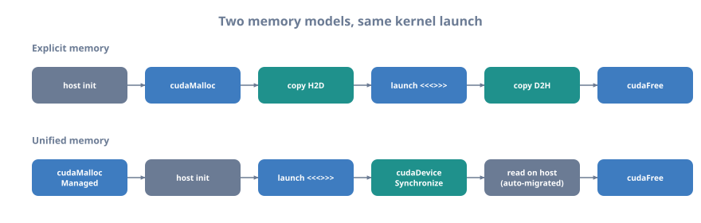

# 02 — Your First Kernel

> Part of **[CUDA Know-Hows](README.md)**. Prev: [01 — Setup & compilation](01_setup_and_compilation.md).
> Next: [03 — Thread hierarchy](03_thread_hierarchy.md).
> Runnable code: [`examples/02_first_kernel.cu`](examples/02_first_kernel.cu).
>
> Goal: write, launch, and understand a real kernel end-to-end. You'll learn
> `__global__`, the `<<<grid, block>>>` launch syntax, both memory models
> (unified and explicit), rock-solid error checking, and the vector-add "hello
> world" that every CUDA programmer starts with.

---

## 1. What is a kernel?

A **kernel** is a function that runs on the GPU, launched from the CPU, executed
by many threads *at once*. You write the code for **one** thread; the hardware
runs it across thousands of threads that differ only by their index.

```
   CPU (serial):  one thread walks the whole array
     for (i = 0; i < N; i++)  C[i] = A[i] + B[i];

   GPU (parallel): N threads, each does ONE element, simultaneously
     thread 0 -> C[0]=A[0]+B[0]     thread 1 -> C[1]=A[1]+B[1]   ...
     thread 2 -> C[2]=A[2]+B[2]     thread 3 -> C[3]=A[3]+B[3]   ... (all at once)
```

The three function qualifiers you must know:

```
   ┌────────────┬───────────────┬───────────────┬──────────────────────────────┐
   │ qualifier  │ runs on       │ callable from │ notes                        │
   ├────────────┼───────────────┼───────────────┼──────────────────────────────┤
   │ __global__ │ device (GPU)  │ host (usually)│ a KERNEL; returns void;      │
   │            │               │               │ launched with <<<...>>>      │
   │ __device__ │ device (GPU)  │ device        │ a GPU helper function        │
   │ __host__   │ host (CPU)    │ host          │ normal CPU function (default)│
   └────────────┴───────────────┴───────────────┴──────────────────────────────┘
   You can combine __host__ __device__ to compile one function for both.
```

---

## 2. Writing the kernel

```cpp
// __global__ marks this as a kernel: runs on the GPU, returns void.
__global__ void vecAdd(const float* A, const float* B, float* C, int n) {
    // Each thread computes its own unique global index (see Ch. 03):
    int i = blockIdx.x * blockDim.x + threadIdx.x;
    if (i < n) {                 // bounds check: we may launch more threads than n
        C[i] = A[i] + B[i];      // this thread does exactly ONE addition
    }
}
```

```
   Anatomy of the index:  i = blockIdx.x * blockDim.x + threadIdx.x
                              └───┬────┘   └───┬────┘   └────┬────┘
                          which block    threads/block   my slot in block
   Every one of the (grid*block) threads runs this SAME code; only `i` differs.
   The `if (i < n)` guard lets us launch a round number of threads safely.
```

---

## 3. Launching the kernel: `<<<grid, block>>>`

The triple-chevron **execution configuration** says how many threads to run:
how many **blocks** (the grid), and how many **threads per block**.

```cpp
int threads = 256;                             // threads per block (a good default)
int blocks  = (n + threads - 1) / threads;     // enough blocks to cover n (ceil)
vecAdd<<<blocks, threads>>>(dA, dB, dC, n);    // launch! (asynchronous)
```

```
   <<< blocks , threads >>>   e.g. n=1000, threads=256 -> blocks = ceil(1000/256)=4
   grid = 4 blocks x 256 threads = 1024 threads launched (24 idle, guarded by if)

   block 0        block 1        block 2        block 3
   [0 .. 255]     [256 .. 511]   [512 .. 767]   [768 .. 1023]
                                                    ^ threads 1000..1023 do nothing
```

> The ceiling-division idiom `(n + threads - 1) / threads` appears constantly.
> Modern CUDA (CCCL) offers `cuda::ceil_div(n, threads)` from `<cuda/cmath>` — same
> result, clearer intent.

There is also a lower-level `cudaLaunchKernelEx` API (used for advanced launch
attributes like clusters, Chapter 21), but triple-chevron is what you'll use 99%
of the time.

---

## 4. Two ways to get data to the GPU

The arrays `A`, `B`, `C` must live in memory the GPU can read. There are two
approaches; learn both.

### 4a. Unified memory (`cudaMallocManaged`) — the easy way

One allocation is accessible from **both** CPU and GPU; the driver migrates pages
on demand. Less code, great for getting started and for irregular access.

```cpp
#include <cuda_runtime.h>
#include <cuda/cmath>          // cuda::ceil_div

float *A, *B, *C;
size_t bytes = n * sizeof(float);
cudaMallocManaged(&A, bytes);              // accessible from host AND device
cudaMallocManaged(&B, bytes);
cudaMallocManaged(&C, bytes);

for (int i = 0; i < n; ++i) { A[i] = 1.0f; B[i] = 2.0f; }   // init on the HOST

int threads = 256;
vecAdd<<<cuda::ceil_div(n, threads), threads>>>(A, B, C, n);
cudaDeviceSynchronize();                   // WAIT for the kernel before reading C

printf("C[0] = %f\n", C[0]);               // read on the HOST — driver migrated it
cudaFree(A); cudaFree(B); cudaFree(C);
```

```
   UNIFIED MEMORY: the driver moves pages between CPU and GPU automatically.
      allocate once ──▶ use on CPU ──▶ launch ──▶ (driver migrates) ──▶ use on GPU
   + simplest code, no explicit copies      - implicit migrations can surprise
   + ideal for prototyping / irregular data   you (profile; use prefetch/advise,
                                               Ch. 06, for performance)
```

### 4b. Explicit memory (`cudaMalloc` + `cudaMemcpy`) — the control way

You allocate device buffers and copy data across yourself. More verbose, but you
control exactly when transfers happen (essential for overlap, Chapter 13).

```cpp
float *hA = ..., *hB = ..., *hC = ...;      // host arrays (ideally pinned, below)
float *dA, *dB, *dC;                        // device pointers
size_t bytes = n * sizeof(float);

cudaMalloc(&dA, bytes);                      // allocate on the GPU
cudaMalloc(&dB, bytes);
cudaMalloc(&dC, bytes);

cudaMemcpy(dA, hA, bytes, cudaMemcpyHostToDevice);   // copy inputs UP to GPU
cudaMemcpy(dB, hB, bytes, cudaMemcpyHostToDevice);

int threads = 256;
vecAdd<<<cuda::ceil_div(n, threads), threads>>>(dA, dB, dC, n);

cudaMemcpy(hC, dC, bytes, cudaMemcpyDeviceToHost);   // copy result DOWN (also syncs)

cudaFree(dA); cudaFree(dB); cudaFree(dC);
```

```
   EXPLICIT MEMORY: you manage two separate address spaces.
     HOST RAM ──cudaMemcpy(H2D)──▶ DEVICE VRAM ──kernel──▶ ──cudaMemcpy(D2H)──▶ HOST
   cudaMemcpy KINDS:
     cudaMemcpyHostToDevice   CPU -> GPU
     cudaMemcpyDeviceToHost   GPU -> CPU
     cudaMemcpyDeviceToDevice within/between GPUs
     cudaMemcpyDefault        infer direction from the pointers (modern, preferred)
   cudaMemcpy is SYNCHRONOUS — it blocks the host until the copy completes.
```

> **Best practice for explicit copies:** allocate host buffers with
> `cudaMallocHost` (page-locked / "pinned" memory) instead of `malloc`. Pinned
> memory copies faster and is *required* for asynchronous transfers (Chapter 13).
> Don't pin excessively — it's a limited system resource.

```
   WHICH TO USE?
   Unified  : learning, prototyping, irregular/pointer-based data, big codebases
              where manual copies are error-prone. Add prefetch hints for perf.
   Explicit : maximum performance, when you want to overlap copies with compute
              (Ch. 13), or control exactly what lives where.
```

---

## 5. Error checking — do this from day one

CUDA calls return error codes; kernels fail *silently*. Ignoring errors is the
#1 way to waste hours. Wrap every API call, and check kernels explicitly.

```cpp
#include <cstdio>
#include <cstdlib>

#define CUDA_CHECK(call)                                                      \
    do {                                                                      \
        cudaError_t err__ = (call);                                           \
        if (err__ != cudaSuccess) {                                           \
            fprintf(stderr, "CUDA error %s at %s:%d -> %s\n",                 \
                    cudaGetErrorName(err__), __FILE__, __LINE__,              \
                    cudaGetErrorString(err__));                               \
            exit(EXIT_FAILURE);                                               \
        }                                                                     \
    } while (0)

// Usage:
CUDA_CHECK(cudaMalloc(&dA, bytes));
CUDA_CHECK(cudaMemcpy(dA, hA, bytes, cudaMemcpyHostToDevice));
```

Kernels don't return a value, so check them in two stages:

```cpp
vecAdd<<<blocks, threads>>>(dA, dB, dC, n);
CUDA_CHECK(cudaGetLastError());       // catches LAUNCH errors (bad config, etc.)
CUDA_CHECK(cudaDeviceSynchronize());  // catches RUNTIME errors (illegal access)
```

```
   TWO KINDS OF KERNEL ERROR — you must check for BOTH:
   1. LAUNCH error  (synchronous): bad grid/block dims, too much shared mem.
      -> cudaGetLastError() right after the launch.
   2. EXECUTION error (asynchronous): out-of-bounds access, illegal instruction.
      -> surfaces at the NEXT sync point (cudaDeviceSynchronize / next cudaMemcpy).
   Because launches are async, an execution error may appear "at" a later, innocent
   API call. In debug, cudaDeviceSynchronize() right after the launch localizes it.
```

> Use `compute-sanitizer ./prog` (Chapter 18) to catch out-of-bounds and race
> bugs precisely — it's the CUDA equivalent of AddressSanitizer.

---

## 6. Timing it (and why the CPU comparison is dramatic)

Use CUDA **events** to time GPU work (they measure on the GPU timeline, unlike
CPU clocks, which would just measure the async launch returning):

```cpp
cudaEvent_t start, stop;
cudaEventCreate(&start); cudaEventCreate(&stop);
cudaEventRecord(start);
vecAdd<<<blocks, threads>>>(dA, dB, dC, n);
cudaEventRecord(stop);
cudaEventSynchronize(stop);                 // wait for the event
float ms = 0; cudaEventElapsedTime(&ms, start, stop);
printf("kernel: %.3f ms\n", ms);
```

```
   For vector add (memory-bound), the "speedup vs CPU" is real but be honest:
   include the PCIe transfer time in any fair comparison. Vector add moves 3
   arrays and does 1 add each -> it is BANDWIDTH-bound (arithmetic intensity ~0.08,
   see roofline in Ch. 00). The GPU wins because its memory bandwidth is ~10-20x
   the CPU's, not because of "more cores doing math."
```

---

## 7. The complete flow, annotated



<details class="ascii-diagram">
<summary>ASCII diagram</summary>
<pre><code>   ┌────────────────────────────────────────────────────────────────────────┐
   │  EXPLICIT MEMORY VERSION                                               │
   │                                                                        │
   │  host init ─▶ cudaMalloc ─▶ H2D copy ─▶ LAUNCH &lt;&lt;&lt;&gt;&gt;&gt; ─▶ D2H copy ─▶   │
   │  free ─▶ use results                                                   │
   │                     ▲ async! check cudaGetLastError() + sync           │
   │                                                                        │
   │  UNIFIED MEMORY VERSION                                                │
   │                                                                        │
   │  cudaMallocManaged ─▶ host init ─▶ LAUNCH &lt;&lt;&lt;&gt;&gt;&gt; ─▶ cudaDeviceSync ─▶  │
   │  read on host (driver migrated) ─▶ cudaFree                            │
   └────────────────────────────────────────────────────────────────────────┘</code></pre>
</details>

Build and run the full worked example:

```bash
cd examples
make 02_first_kernel        # set ARCH=sm_XX for your GPU
./02_first_kernel
```

---

## 8. Common first-kernel mistakes

```
   ✗ Forgetting the bounds check `if (i < n)` -> out-of-bounds writes (UB/crash).
   ✗ Reading results before cudaDeviceSynchronize()/D2H copy -> garbage (async!).
   ✗ Passing a HOST pointer to a kernel (explicit mode) -> illegal access.
   ✗ Not checking errors -> silent failure; you "see" stale/zero output.
   ✗ Launching 0 blocks (n < threads with wrong math) -> kernel does nothing.
   ✗ Mixing up cudaMemcpy direction -> wrong/garbage data, no error.
   ✗ Timing with CPU clock around an async launch -> measures ~nothing.
```

---

## 9. Key takeaways

- A **kernel** (`__global__`, returns `void`) is written for one thread and run
  by many; each thread finds its data via its index.
- Launch with **`<<<blocks, threads>>>`**; size blocks with
  `cuda::ceil_div(n, threads)` and guard with `if (i < n)`.
- **Unified memory** (`cudaMallocManaged`) is the easy path (auto-migration);
  **explicit** (`cudaMalloc` + `cudaMemcpy`, pinned host memory) gives control
  and enables overlap. Know both.
- Kernel launches are **asynchronous** — synchronize before reading results.
- **Check every error**: `CUDA_CHECK` API calls, and `cudaGetLastError()` +
  sync after kernels (launch vs execution errors). Use `compute-sanitizer`.
- Time GPU work with **CUDA events**, and be honest about transfer costs and the
  memory-bound nature of simple kernels.

**Next:** [03 — Thread hierarchy →](03_thread_hierarchy.md)
