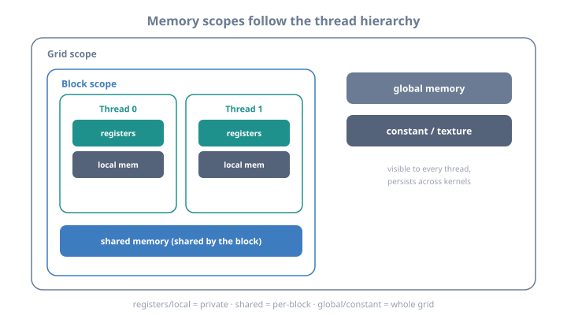

# 05 — Memory Model & Coalescing

> Part of **[CUDA Know-Hows](README.md)**. Prev: [04 — Thread indexing patterns](04_thread_indexing_patterns.md).
> Next: [06 — Memory management](06_memory_management.md).
> Runnable code: [`examples/03_memory_model.cu`](examples/03_memory_model.cu).
>
> Goal: the highest-leverage GPU chapter. Most kernels are **memory-bound**, so
> how threads touch memory decides speed. You'll learn every memory space, the
> all-important **coalescing** rule, access patterns ranked, constant/texture
> memory, and how to measure bandwidth.

---

## 1. The GPU memory spaces

```
   ┌──────────────────────────────────────────────────────────────────────────────┐
   │ space     │ scope   │ lifetime │ latency   │ size        │ managed by        │
   ├───────────┼─────────┼──────────┼───────────┼─────────────┼───────────────────┤
   │ Register  │ thread  │ thread   │ ~1 cyc    │ 255/thread  │ compiler          │
   │ Local     │ thread  │ thread   │ ~400 cyc  │ (spills)    │ compiler (in DRAM)│
   │ Shared    │ block   │ block    │ ~20 cyc   │ up to 228KB │ YOU (__shared__)  │
   │ L1 cache  │ SM      │ auto     │ ~30 cyc   │ ~128-256KB  │ hardware          │ 
   │ L2 cache  │ device  │ auto     │ ~200 cyc  │ 6-96 MB     │ hardware          │
   │ Global    │ grid    │ app      │ ~400+ cyc │ up to ~192GB│ YOU (cudaMalloc)  │
   │ Constant  │ grid    │ app      │ ~5 cyc*   │ 64 KB       │ YOU (__constant__)│
   │ Texture   │ grid    │ app      │ ~cached   │ device dep. │ YOU (tex objs)    │
   └──────────────────────────────────────────────────────────────────────────────┘
   *constant is fast ONLY when all threads in a warp read the SAME address (broadcast).
```



<details class="ascii-diagram">
<summary>ASCII diagram</summary>
<pre><code>   PHYSICAL PICTURE (per SM view):

              ┌──────────────── one SM ─────────────────┐
   threads -&gt; │  Registers (per-thread, fastest)        │
              │  Shared memory / L1  (per-block, fast)  │
              └───────────────────┬─────────────────────┘
                                  │
                      ┌───────────▼───────────┐
                      │   L2 cache (shared)   │   ~MBs, all SMs
                      └───────────┬───────────┘
                                  │
                      ┌───────────▼────────────┐
                      │  Global memory (DRAM,  │   GBs, HBM/GDDR
                      │  HBM3e / GDDR6X)       │   high bandwidth, high latency
                      └────────────────────────┘</code></pre>
</details>

The performance game is **moving work up this pyramid**: turn global-memory
traffic into shared-memory reuse (Chapter 07) and register reuse, and make the
global accesses you *must* do as efficient as possible (coalescing, below).

---

## 2. Coalescing — the #1 rule of GPU memory

Global memory is served in **transactions** of 32, 64, or 128 bytes (aligned
segments, typically 128 B = a cache line). When the 32 threads of a warp issue a
memory instruction *together*, the hardware coalesces their accesses into as few
transactions as possible. **Contiguous, aligned access = few wide transactions =
full bandwidth. Scattered access = many transactions = wasted bandwidth.**

```
   COALESCED (good): thread i accesses element i -> one 128-byte transaction
      warp lanes:  t0  t1  t2  t3 ... t31
      addresses:   a+0 a+4 a+8 ...       (consecutive floats)
                   [============ one 128B segment ============]   FULL bandwidth

   UNCOALESCED (bad): thread i accesses element i*stride -> scattered
      t0->a+0   t1->a+128   t2->a+256 ...
      [128B][128B][128B]... 32 separate transactions -> ~1/32 of bandwidth

   THE RULE OF THUMB:  make thread `i` (specifically threadIdx.x) access memory
   location `base + i`. Consecutive THREADS should touch consecutive ADDRESSES.
```

This is the GPU analogue of CPU cache-line locality (see `cpp-hpc` Module 03),
but stricter and at warp granularity — and it's usually the difference between a
mediocre and a great kernel.

### Why row-major traversal matters (same lesson as CPU, warp-scale)

```cpp
// Row-major matrix M[row][col] stored at M[row*W + col].
// GOOD: threadIdx.x maps to `col` -> consecutive threads hit consecutive cols
int col = blockIdx.x*blockDim.x + threadIdx.x;
int row = blockIdx.y*blockDim.y + threadIdx.y;
M[row*W + col] = ...;      // warp (varying threadIdx.x=col) is contiguous -> coalesced

// BAD: threadIdx.x maps to `row` -> consecutive threads jump by W -> uncoalesced
M[col*W + row] = ...;      // stride W between lanes -> 32 transactions
```

---

## 3. Access patterns ranked

```
   FASTEST ┌────────────────────────────────────────────────────────────────┐
      │    │ 1. Coalesced sequential   lane i -> base+i        1 transaction│
      │    │ 2. Coalesced + aligned to 128B                    optimal      │
      │    │ 3. Misaligned but contiguous  slight overhead (1 extra segment)│
      │    │ 4. Strided (stride 2,4...)   proportionally more transactions  │
      │    │ 5. Random / gather-scatter   worst; up to 32 transactions/warp │
      ▼    │ 6. Pointer chasing           dependent + random = catastrophic │
   SLOWEST └────────────────────────────────────────────────────────────────┘

   VECTORIZED loads (float4, int4) move 128 bits/thread in one instruction,
   improving bandwidth utilization when data is 16-byte aligned (Ch. 15).
```

```cpp
// Vectorized load: 4 floats per thread in one 128-bit transaction
float4 v = reinterpret_cast<const float4*>(data)[i];   // needs 16-byte alignment
out[i] = v.x + v.y + v.z + v.w;
```

---

## 4. Constant memory — broadcast-optimized read-only

64 KB of read-only memory with a dedicated cache. It shines when **every thread
in a warp reads the same address** (e.g. a coefficient, a filter weight): the
value is broadcast to all lanes in one access. If lanes read *different*
addresses, constant memory serializes and is slow.

```cpp
__constant__ float filter[256];                 // declared at file scope

// host: copy into it
cudaMemcpyToSymbol(filter, hFilter, 256*sizeof(float));

__global__ void conv(const float* in, float* out, int n) {
    int i = blockIdx.x*blockDim.x + threadIdx.x;
    float s = 0;
    for (int k = 0; k < 256; ++k)
        s += in[i+k] * filter[k];               // filter[k] SAME for all lanes -> broadcast
    out[i] = s;
}
```

```
   CONSTANT MEMORY:
     all 32 lanes read filter[k] (same addr) -> ONE broadcast -> fast
     if lanes read filter[threadIdx.x] (diff addrs) -> serialized -> slow
   Use for: small, read-only, uniformly-accessed data (kernel params, coefficients).
```

---

## 5. Texture / read-only cache — spatial locality & filtering

Texture memory routes through a cache optimized for 2D/3D **spatial** locality,
with optional hardware interpolation, normalized coordinates, and boundary
handling (clamp/wrap). Great for image processing and stencils with 2D reuse.

```cpp
// Modern texture object API (not the old deprecated texture references):
cudaTextureObject_t tex;    // created from a cudaArray or linear memory
// in kernel:
float v = tex2D<float>(tex, x + 0.5f, y + 0.5f);   // cached, optional filtering
```

For read-only global data you don't need filtering for, the simpler win is
`__restrict__` + `const`, which lets the compiler route loads through the
read-only data cache (`__ldg`):

```cpp
__global__ void k(const float* __restrict__ in, float* out, int n) { ... }
// const + __restrict__ -> compiler may use the read-only cache automatically
```

---

## 6. Registers & local memory — the fastest and a hidden trap

Registers are the fastest storage, private per thread. But there are only ~65,536
per SM to split among all resident threads — so **more registers per thread means
fewer threads resident (lower occupancy)**, and if you exceed the per-thread
limit, variables **spill to "local memory," which is actually global DRAM
(~400-cycle latency)**. A spilling kernel can be silently slow.

```
   REGISTER PRESSURE:
     few regs/thread  -> more warps resident -> better latency hiding (Ch. 08)
     many regs/thread -> fewer warps, or SPILLS to slow local memory
   Diagnose with: nvcc -Xptxas -v   (prints "registers" and "spill stores/loads")
   Control with:  -maxrregcount=N  or __launch_bounds__(threads, minBlocks)
```

```
   "Local memory" is a misnomer: it is per-thread storage in GLOBAL DRAM, used
   for register spills and for arrays you index dynamically. It IS coalesced by
   the hardware across a warp, but it's still DRAM latency. Avoid large per-thread
   arrays and register spills in hot kernels.
```

---

## 7. Measuring memory performance

Effective bandwidth tells you how close you are to the roofline (Chapter 00):

```
   effective GB/s = (bytes_read + bytes_written) / kernel_time / 1e9
   compare to the card's peak (nvidia-smi / spec, e.g. ~2-8 TB/s HBM3e).
   A memory-bound kernel near peak bandwidth is "done" — more compute won't help.
```

Nsight Compute (Chapter 18) reports this directly, plus:

```
   KEY NSIGHT COMPUTE MEMORY METRICS:
     - Memory Throughput (% of peak)          <- are you bandwidth-bound?
     - Global Load/Store Efficiency (%)        <- coalescing quality (100% = perfect)
     - L1/L2 hit rates                         <- reuse effectiveness
     - "Uncoalesced global accesses" warnings  <- direct fix list
```

Run the example to see coalesced vs strided vs random access, and constant vs
global, measured on your GPU:

```bash
cd examples && make 03_memory_model && ./03_memory_model
```

---

## 8. Key takeaways

- Know the **memory spaces** and their latencies; performance = moving traffic up
  the pyramid (global → shared/registers).
- **Coalescing is the #1 rule**: consecutive threads (`threadIdx.x`) must touch
  consecutive addresses → few wide transactions → full bandwidth. Scattered
  access wastes up to 32×.
- Rank of access patterns: **coalesced+aligned > contiguous > strided > random >
  pointer-chasing**. Use **vectorized loads** (`float4`) when aligned.
- **Constant memory** for small read-only data read uniformly by a warp
  (broadcast); **texture/read-only cache** (`const __restrict__`, `__ldg`,
  texture objects) for 2D spatial locality.
- Watch **register pressure**: spills go to slow local (global) memory; check
  `-Xptxas -v`.
- **Measure** effective bandwidth and load/store efficiency with Nsight Compute.

**Next:** [06 — Memory management →](06_memory_management.md)
