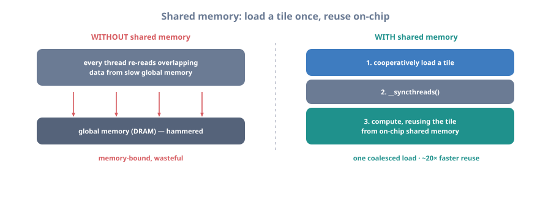
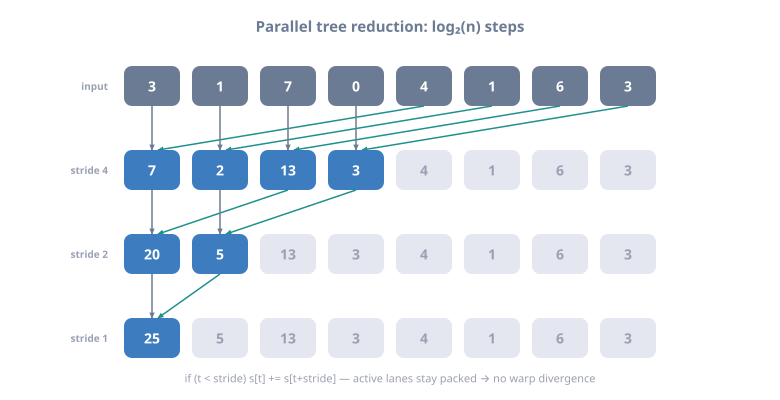

# 07 — Shared Memory

> Part of **[CUDA Know-Hows](README.md)**. Prev: [06 — Memory management](06_memory_management.md).
> Next: [08 — Execution model & occupancy](08_execution_model_and_occupancy.md).
> Runnable code: [`examples/06_shared_memory.cu`](examples/06_shared_memory.cu).
>
> Goal: master the GPU's programmer-managed on-chip scratchpad — the key to
> turning memory-bound kernels compute-bound. You'll learn how shared memory
> works, the **bank conflict** trap, and the canonical patterns: parallel
> **reduction**, **scan** (prefix sum), **histogram**, and **stencil/tiling**.

---

## 1. What shared memory is (and why it's the key optimization)

Shared memory is fast (~L1-speed) on-chip memory, **shared by all threads in a
block**, that *you* explicitly manage. Its purpose: load data from slow global
memory **once**, then let many threads reuse it many times from fast on-chip
storage. This is the GPU version of cache blocking (see `cpp-hpc` Module 03).



<details class="ascii-diagram">
<summary>ASCII diagram</summary>
<pre><code>   WITHOUT shared memory: every thread re-reads overlapping data from GLOBAL mem
      thread 0: reads in[0..2]   thread 1: reads in[1..3]   ... (in[1],in[2] read
      multiple times from slow DRAM)  -&gt; memory-bound, wasteful

   WITH shared memory: load the tile ONCE to on-chip, reuse from there
      ┌──────────── block ─────────────┐
      │  1. all threads cooperatively  │   global mem ──(one coalesced load)──▶ smem
      │     load a tile into __shared__│
      │  2. __syncthreads()            │   ┌──────────────┐
      │  3. compute reusing smem       │   │ shared mem   │◀── reused by all threads
      │     (fast, no repeated DRAM)   │   │ (on-chip)    │    ~20x faster than DRAM
      └────────────────────────────────┘   └──────────────┘
</code></pre>
</details>

Declaration and the mandatory synchronization:

```cpp
__global__ void k(const float* in, float* out) {
    __shared__ float tile[256];                 // static: size known at compile time
    int t = threadIdx.x;
    tile[t] = in[blockIdx.x*256 + t];           // cooperative, coalesced load
    __syncthreads();                            // ALL threads finish loading first
    // ... now safely read any tile[j] written by another thread ...
}
```

```
   __syncthreads() is a BARRIER for all threads in the block: no thread passes
   until every thread arrives. You need it whenever one thread reads shared data
   that ANOTHER thread wrote. Forgetting it = race = wrong results.
   CRITICAL: __syncthreads() must be reached by ALL threads. Calling it inside a
   divergent branch (some threads skip it) causes a HANG or undefined behavior.
```

Dynamic shared memory (size chosen at launch):

```cpp
extern __shared__ float tile[];                 // size unknown at compile time
kernel<<<grid, block, shmemBytes>>>(...);       // 3rd launch arg = bytes of smem
```

---

## 2. Bank conflicts — the shared-memory performance trap

Shared memory is divided into **32 banks** (one per warp lane). A bank can serve
one 32-bit word per cycle. If the 32 threads of a warp access **32 different
banks** (or all the same address = broadcast), it's a single fast transaction. If
two+ threads hit the **same bank** at *different* addresses, those accesses
**serialize** (an N-way conflict is N× slower).

```
   32 banks, addresses map as: bank = (address/4) % 32

   NO CONFLICT (good): lane i -> word i -> bank i (all different banks)
     lane:  0  1  2  3 ... 31
     bank:  0  1  2  3 ... 31          -> 1 cycle, full speed

   2-WAY CONFLICT (bad): lane i -> word i*2 -> lanes 0 and 16 both hit bank 0, etc.
     lane:  0        1        ...
     word:  0        2        ...
     bank:  0        2        ...  but stride 2 makes lanes collide -> 2x slower

   BROADCAST (fine): all lanes -> same address -> hardware broadcasts, 1 cycle.
```

The classic conflict: a 2D shared array with a power-of-two width, accessed by
column. Fix with **padding** (`+1` column):

```cpp
// BAD: 32-wide -> column access makes all lanes hit the same bank (32-way conflict)
__shared__ float tile[32][32];
float v = tile[threadIdx.x][col];     // stride 32 -> 32-way conflict

// GOOD: pad to 33 -> column access spreads across all banks
__shared__ float tile[32][33];        // one extra column shifts the mapping
float v = tile[threadIdx.x][col];     // now conflict-free
```

```
   PADDING TRICK:  [32][33] wastes one column but breaks the stride-32 aliasing
   so each lane lands in a different bank. A staple of tiled kernels (Ch. 11).
```

---

## 3. Pattern: parallel reduction (sum an array)

Summing N numbers is inherently serial, but a **tree reduction** does it in
log₂(N) steps. Shared memory holds the running partial sums within a block.

```cpp
__global__ void reduceSum(const float* in, float* blockSums, int n) {
    __shared__ float s[256];
    int t   = threadIdx.x;
    int idx = blockIdx.x*blockDim.x + t;
    s[t] = (idx < n) ? in[idx] : 0.0f;      // load into shared
    __syncthreads();

    // Tree reduction: halve the active threads each step (no warp divergence)
    for (int stride = blockDim.x/2; stride > 0; stride >>= 1) {
        if (t < stride) s[t] += s[t + stride];
        __syncthreads();
    }
    if (t == 0) blockSums[blockIdx.x] = s[0];  // one partial sum per block
}
```



<details class="ascii-diagram">
<summary>ASCII diagram</summary>
<pre><code>   TREE REDUCTION (8 elements): log2(8)=3 steps instead of 7 serial adds

   step0:  s: [3][1][7][0][4][1][6][3]
                └─┬─┘ +  └─┬─┘  ...     stride=4: s[t]+=s[t+4]
   step1:  s: [7][2][13][3]  ...        stride=2
   step2:  s: [9][5] ...                stride=1
   step3:  s: [14] ...                  done -&gt; s[0] holds the block sum

   WHY `if (t &lt; stride)` (contiguous active threads) beats `if (t % (2*stride)==0)`:
   it keeps ACTIVE lanes packed into whole warps -&gt; avoids warp divergence (Ch. 08).</code></pre>
</details>

For the last warp (stride < 32), threads are implicitly synchronized within a
warp; modern code uses **warp shuffle** (`__shfl_down_sync`, Chapter 14) to
finish without shared memory or `__syncthreads()`:

```cpp
// Warp-level reduction (last 32 elements), no shared mem, no barrier:
for (int off = 16; off > 0; off >>= 1)
    val += __shfl_down_sync(0xffffffff, val, off);
```

---

## 4. Pattern: prefix sum (scan)

A **scan** turns `[3,1,7,0]` into `[0,3,4,11]` (exclusive) — each output is the
sum of all previous inputs. Foundational for stream compaction, sorting, sparse
ops. The work-efficient Blelloch scan uses an up-sweep then down-sweep in shared
memory.

```
   INCLUSIVE SCAN of [3,1,7,0,4,1,6,3]:
     input:   3  1  7  0  4  1  6  3
     output:  3  4 11 11 15 16 22 25   (running total)

   HILLIS-STEELE (simple, O(n log n) work): add neighbor at increasing offsets
     step d=1:  x[i] += x[i-1]
     step d=2:  x[i] += x[i-2]
     step d=4:  x[i] += x[i-4]        (double-buffer in shared mem to avoid races)

   BLELLOCH (work-efficient, O(n)): up-sweep (reduce) then down-sweep — preferred
   for large scans. In practice, use CUB's DeviceScan (Ch. 20) for production.
```

> **In production, don't hand-roll scan/reduce** — CUB (`cub::DeviceReduce`,
> `cub::DeviceScan`) and Thrust give tuned, correct implementations (Chapter 20).
> Learn the pattern here to understand what they do and to fuse it into custom
> kernels.

---

## 5. Pattern: histogram (atomics + privatization)

Counting values into bins has *write conflicts* (many threads want to increment
the same bin). Naive global atomics serialize. The trick: keep a **private
histogram in shared memory per block**, then merge into the global one — moving
contention from slow global to fast shared memory.

```cpp
__global__ void histogram(const unsigned char* data, int n, int* globalHist) {
    __shared__ int local[256];
    int t = threadIdx.x;
    for (int i = t; i < 256; i += blockDim.x) local[i] = 0;   // zero shared hist
    __syncthreads();

    int idx = blockIdx.x*blockDim.x + t;
    if (idx < n) atomicAdd(&local[data[idx]], 1);             // fast SHARED atomic
    __syncthreads();

    for (int i = t; i < 256; i += blockDim.x)                 // merge to global
        atomicAdd(&globalHist[i], local[i]);
}
```

```
   PRIVATIZATION: contention moves from global (all blocks) to shared (one block).
     naive: every thread atomicAdd to global -> massive contention -> slow
     priv.: atomicAdd to per-block shared hist, then ONE merge per bin per block
   Shared-memory atomics are far cheaper than global ones. (Atomics: Chapter 12.)
```

---

## 6. Pattern: stencil / tiling with halos

Stencils (each output needs its neighbors) reuse data heavily. Load a tile plus a
**halo** (the neighboring elements at the edges) into shared memory once, then
compute from shared memory.

```
   1D 3-point stencil, tile of 4 with halo of 1 on each side:

   global:  ... x3 [x4 x5 x6 x7] x8 ...
                 └halo┘ tile └halo┘
   shared:  [h][x4][x5][x6][x7][h]     load tile + 2 halo cells, __syncthreads()
   compute: out[i] = (s[i-1] + s[i] + s[i+1]) / 3   all reads from fast shared mem
```

This same idea powers tiled matrix multiply (Chapter 11), image convolution, and
PDE solvers (Chapter 22).

---

## 7. Shared memory, occupancy, and the L1 split

Shared memory is a *finite* per-SM resource shared with L1 cache. Using more
shared memory per block means fewer blocks fit per SM (lower occupancy, Chapter
08). On many architectures you can tune the L1/shared split and opt into larger
shared memory:

```cpp
// Opt in to more than the 48KB default (Volta+), and configure the L1/smem carveout:
cudaFuncSetAttribute(kernel, cudaFuncAttributeMaxDynamicSharedMemorySize, 100*1024);
cudaFuncSetAttribute(kernel, cudaFuncAttributePreferredSharedMemoryCarveout, 50);
```

```
   TRADE-OFF:  more shared mem/block -> more reuse per block, but fewer resident
   blocks -> less latency hiding. Tune both and measure (Nsight, Ch. 18).
```

Run the worked examples (reduction, scan, histogram, bank conflicts):

```bash
cd examples && make 06_shared_memory && ./06_shared_memory
```

---

## 8. Key takeaways

- Shared memory is a **programmer-managed on-chip scratchpad per block**: load
  from global once, reuse many times → turns memory-bound kernels compute-bound.
- Always **`__syncthreads()`** between writing and reading shared data across
  threads; never call it in a divergent branch.
- Avoid **bank conflicts** (32 banks): make warp lanes hit distinct banks; **pad**
  power-of-two 2D arrays (`[N][N+1]`).
- Master the canonical patterns: **tree reduction** (keep active lanes packed),
  **scan**, **privatized histogram** (shared atomics), **stencil/tiling with
  halos**.
- Shared memory competes with occupancy and shares hardware with L1 — tune the
  amount and the carveout, and measure.
- For production reduce/scan/sort, prefer **CUB/Thrust** (Chapter 20).

**Next:** [08 — Execution model & occupancy →](08_execution_model_and_occupancy.md)
