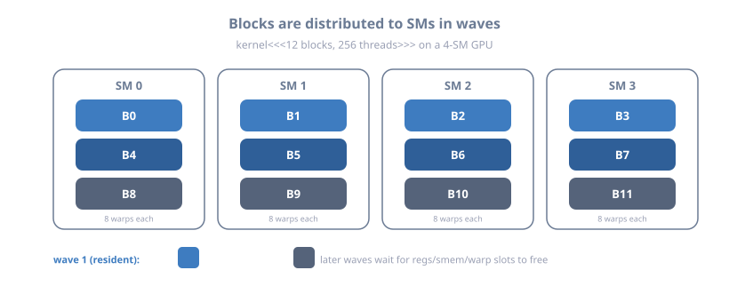
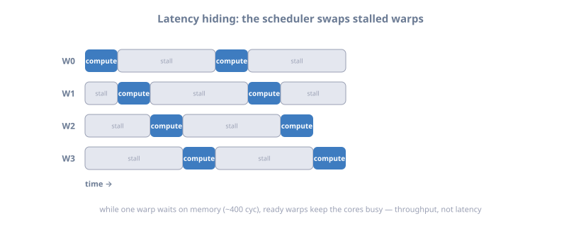

# 08 — Execution Model & Occupancy

> Part of **[CUDA Know-Hows](README.md)**. Prev: [07 — Shared memory](07_shared_memory.md).
> Next: [09 — Work allocation](09_work_allocation.md).
>
> Goal: understand what the hardware *actually does* with your threads — how
> blocks map to SMs, how warps are scheduled, why divergence hurts, how latency
> is hidden, and what **occupancy** really means (and its limits). This is the
> bridge between "writing kernels" and "making them fast."

---

## 1. From launch to execution: blocks → SMs → warps

When you launch a kernel, the GPU's scheduler distributes **blocks** onto
**Streaming Multiprocessors (SMs)**. Each SM runs the blocks assigned to it,
executing their **warps** (32 threads). A block stays on one SM for its entire
life and never migrates.



<details class="ascii-diagram">
<summary>ASCII diagram</summary>
<pre><code>   kernel&lt;&lt;&lt;12 blocks, 256 threads&gt;&gt;&gt;   on a GPU with 4 SMs:

   ┌── SM0 ──┐ ┌── SM1 ──┐ ┌── SM2 ──┐ ┌── SM3 ──┐
   │ B0  B4  │ │ B1  B5  │ │ B2  B6  │ │ B3  B7  │   first wave (2 blocks/SM if
   │ B8      │ │ B9      │ │ B10     │ │ B11     │   they fit), then more as slots
   └─────────┘ └─────────┘ └─────────┘ └─────────┘   free up

   Each block (256 threads) = 8 warps. The SM's warp schedulers pick READY warps
   to issue each cycle. Blocks are assigned as resources (regs/smem/warp slots)
   allow; leftover blocks wait for a slot ("waves").</code></pre>
</details>

```
   RESOURCES THAT LIMIT HOW MANY BLOCKS FIT ON AN SM (all must be satisfied):
     - warp slots     (e.g. 64 warps/SM max)
     - block slots    (e.g. 16-32 blocks/SM max)
     - registers      (e.g. 65536/SM, split among all resident threads)
     - shared memory  (e.g. up to ~228KB/SM, split among resident blocks)
   Whichever runs out FIRST caps how many blocks/warps are resident = occupancy.
```

---

## 2. Warp scheduling & latency hiding (the core idea)

An SM has multiple **warp schedulers**. Each cycle, a scheduler picks a warp that
is *ready* (its next instruction's operands are available) and issues it. When a
warp stalls (e.g. waiting ~400 cycles for a global-memory load), the scheduler
simply issues a *different* ready warp. **This is how the GPU hides latency: not
by making one warp fast, but by always having another warp to run.**



<details class="ascii-diagram">
<summary>ASCII diagram</summary>
<pre><code>   ONE warp (no latency hiding): mostly stalled waiting on memory
     warp A:  compute ──[■■■■■ 400-cycle memory stall ■■■■■]── compute      IDLE SM

   MANY warps (latency hidden): scheduler switches to ready warps
     warp A:  compute ──[■■■ stalled on load ■■■]────────── compute
     warp B:          compute ──[■■ stalled ■■]── compute
     warp C:                  compute ──[■ stall ■]── compute
     warp D:                          compute ...
     SM:      A→B→C→D→A... always issuing SOMETHING -&gt; SM stays BUSY</code></pre>
</details>

```
   KEY CONSEQUENCE: you need ENOUGH resident warps to cover memory latency.
   This is why "expose lots of parallelism" is rule #1. A kernel with too few
   warps per SM leaves the SM idle during every memory stall, no matter how
   clever the math is.
```

---

## 3. Occupancy: definition, and why it's not the whole story

**Occupancy** = (resident warps per SM) / (max warps per SM). It's a proxy for
"how much latency-hiding parallelism is available."

```
   occupancy = active_warps_per_SM / max_warps_per_SM

   e.g. 48 resident warps / 64 max = 75% occupancy.

   HIGHER occupancy -> more warps to hide latency. BUT:
     - occupancy has DIMINISHING returns: once you have enough warps to hide
       latency, more doesn't help.
     - LOW occupancy can still be fast if each thread has high instruction-level
       parallelism (ILP) and many independent memory ops in flight.
     - Sometimes LOWER occupancy is FASTER: more registers/thread (fewer warps)
       can cut spills or enable more ILP. (Volkov's "better performance at lower
       occupancy".)
   => Treat occupancy as a guide, not a goal. Measure actual performance.
```

What lowers occupancy:

```
   registers/thread ↑  -> fewer resident warps (regs run out)
   shared mem/block ↑  -> fewer resident blocks (smem runs out)
   block size odd shape -> wasted warp slots / partial warps
   Diagnose with: nvcc -Xptxas -v (regs, smem) + Nsight Compute "Occupancy" section
```

The Occupancy API and calculator help you reason about it:

```cpp
int minGrid, blockSize;
cudaOccupancyMaxPotentialBlockSize(&minGrid, &blockSize, kernel, 0, 0);
// -> blockSize that maximizes occupancy for this kernel

int maxBlocks;
cudaOccupancyMaxActiveBlocksPerMultiprocessor(&maxBlocks, kernel, blockSize, 0);
// -> how many blocks of that size fit per SM
```

---

## 4. Warp divergence — the branch cost

All 32 threads in a warp share one program counter (with per-thread masks since
Volta). If lanes take *different* paths of a branch, the warp executes **both**
paths, disabling the lanes not on the current path. Divergence within a warp
serializes the branches.

```
   if (threadIdx.x % 2 == 0)  A();  else  B();

   warp lanes:  [A][B][A][B][A][B] ...
     pass 1: run A(), lanes doing B() are MASKED OFF (idle)
     pass 2: run B(), lanes doing A() are MASKED OFF (idle)
   -> both A and B executed by the warp = up to 2x the work.

   NO divergence if the branch is UNIFORM across the warp:
     if (blockIdx.x == 0) ...   // whole warp takes one path -> free
```

```
   FIXES:
     - branch on data that's uniform per warp (blockIdx, warp-aligned ranges)
     - convert small branches to predication / arithmetic (compiler often does this)
     - sort/bucket data so nearby threads take the same path
     - keep divergent, rarely-taken code out of hot loops
   Note: divergence is a WITHIN-warp issue. Different warps taking different paths
   is totally fine and free.
```

---

## 5. Instruction throughput & the arithmetic mix

Each SM has execution units for different operations, in limited quantity. FP32,
INT32, FP64, SFU (transcendentals), and Tensor Cores each have their own
throughput. Mixing wisely keeps units busy; over-using a scarce unit bottlenecks.

```
   ROUGH per-SM instruction throughput (varies by arch):
     FP32 (add/mul/fma) : very high (the bulk of CUDA cores)
     INT32              : high (may share ports with FP32 on some arches)
     FP64               : LOW on consumer GPUs (1/32 - 1/64 of FP32!), high on
                          datacenter (A100/H100 ~1/2). Know your card.
     SFU (sin/exp/rsqrt): low throughput -> use sparingly or via --use_fast_math
     Tensor Cores       : enormous for matrix MMA (Ch. 11, 21)
```

```
   --use_fast_math swaps precise transcendentals for fast SFU approximations
   (like CPU -ffast-math). Big speedups for sin/exp/div-heavy kernels, at reduced
   precision. Use deliberately.
```

---

## 6. Tail effect & wave quantization

Because blocks run in **waves** across SMs, a launch whose block count isn't a
multiple of (SMs × blocks-per-SM) wastes the last, partially-filled wave.

```
   80 SMs, 2 blocks/SM = 160 blocks per wave.
     launch 161 blocks -> wave1 (160 blocks, full) + wave2 (1 block!) 
     -> the whole GPU waits on ONE straggler block for the entire 2nd wave.

   FIX: size grids to fill whole waves (multiple of SMs*blocksPerSM), or use
   grid-stride loops (Ch. 03) with a grid sized to ~#SMs * blocksPerSM so each
   thread does more work and the tail shrinks.
```

---

## 7. Putting it together: the performance mental model

```
   ┌─────────────────────────────────────────────────────────────────────────┐
   │ Is the SM busy every cycle?                                             │
   │   ├─ enough warps resident to hide memory latency?  (occupancy, ILP)    │
   │   ├─ memory accesses coalesced? (Ch. 05)  reuse in shared mem? (Ch. 07) │
   │   ├─ warps NOT diverging on hot branches?                               │
   │   ├─ not bottlenecked on a scarce unit (FP64/SFU)?                      │
   │   └─ grid fills whole waves (no tail straggler)?                        │
   │ If yes to all and still slow -> you're at the roofline (Ch. 00):        │
   │   memory-bound  -> reduce bytes / improve coalescing / reuse            │
   │   compute-bound -> better math mix / Tensor Cores / less work           │
   └─────────────────────────────────────────────────────────────────────────┘
```

Chapter 09 (Work Allocation) turns this into concrete block/grid choices;
Chapter 18 (Profiling) shows how to *measure* each item above with Nsight.

---

## 8. Key takeaways

- The scheduler maps **blocks → SMs** (a block lives entirely on one SM) and
  issues **warps**; leftover blocks run in later **waves**.
- The GPU **hides latency by switching among many resident warps** — so exposing
  enough parallelism is the foundational optimization.
- **Occupancy** = resident/max warps; it's a *guide*, not a goal (diminishing
  returns; low occupancy can win via ILP/registers). It's limited by
  registers/thread, shared mem/block, and warp/block slots — check `-Xptxas -v`.
- **Warp divergence** (lanes taking different branches) serializes paths; keep
  branches uniform per warp. Divergence *between* warps is free.
- Mind the **instruction mix** (FP64/SFU are scarce; Tensor Cores are huge) and
  **wave quantization** (fill whole waves; grid-stride loops help).
- If everything is tight and it's still slow, you're at the **roofline** — fix
  the actual bound (memory vs compute).

**Next:** [09 — Work allocation →](09_work_allocation.md)
