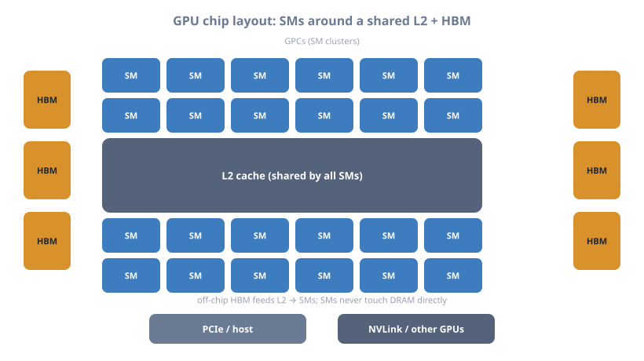
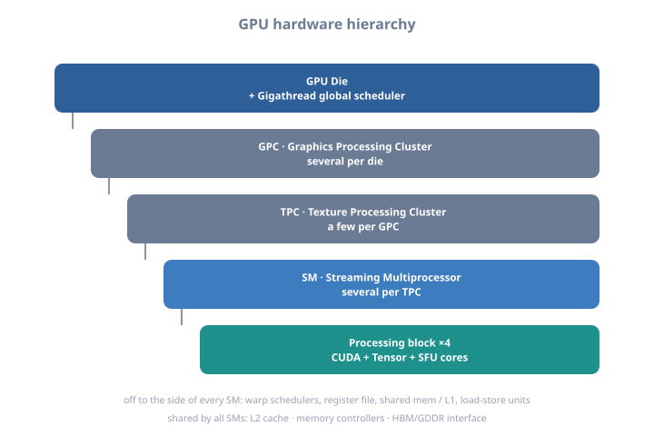
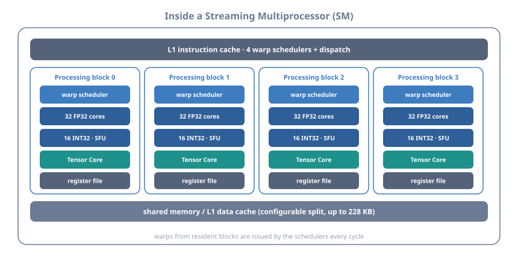
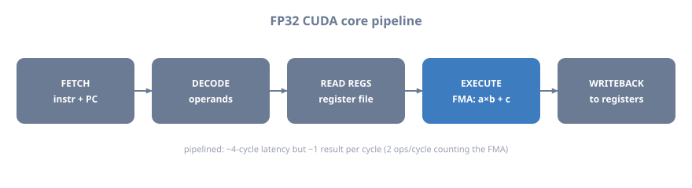
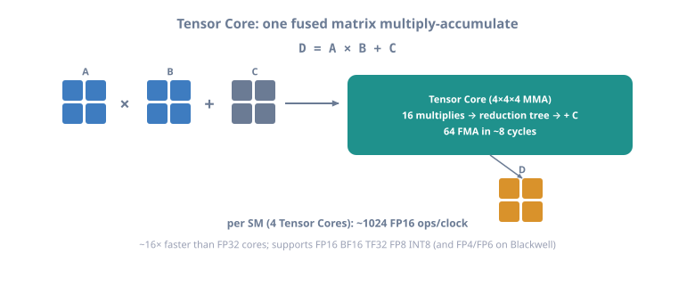
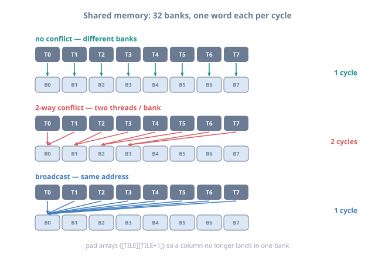
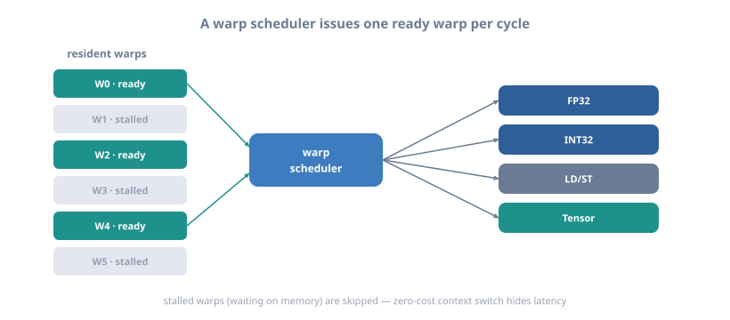
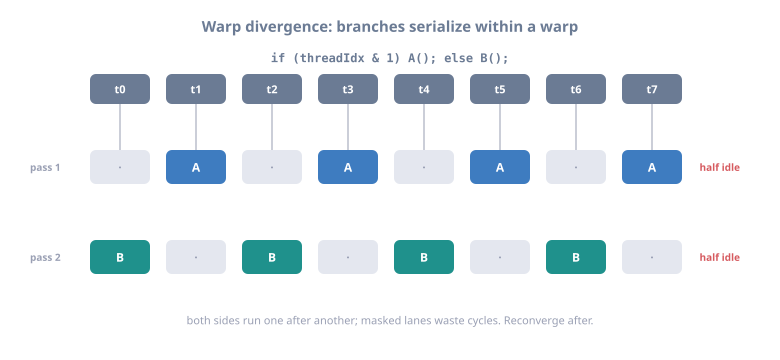
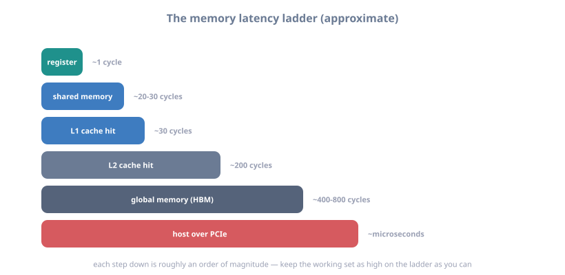

# 10 — GPU Architecture Internals

> Part of **[CUDA Know-Hows](README.md)**. Prev: [09 — Work allocation](09_work_allocation.md).
> Next: [11 — Matrix multiplication](11_matrix_multiplication.md). A hardware deep
> dive — the SM microarchitecture, caches, memory controllers, and interconnects
> that explain *why* the performance rules in earlier chapters hold. (Two parts.)

## Advanced Hardware Architecture Guide

This document provides an in-depth exploration of NVIDIA GPU architecture at the hardware level, intended for advanced users, performance engineers, and those seeking to understand the physical implementation details.

---

## Table of Contents

1. [GPU Die Architecture](#gpu-die-architecture)
2. [Streaming Multiprocessor (SM) Deep Dive](#streaming-multiprocessor-deep-dive)
3. [Execution Units and Pipelines](#execution-units-and-pipelines)
4. [Memory Subsystem Architecture](#memory-subsystem-architecture)
5. [Warp Scheduling and Execution](#warp-scheduling-and-execution)
6. [Cache Hierarchy Details](#cache-hierarchy-details)
7. [Memory Controllers and Interfaces](#memory-controllers-and-interfaces)
8. [Interconnect Architecture](#interconnect-architecture)
9. [Architecture Evolution](#architecture-evolution)
10. [Performance Characteristics](#performance-characteristics)

---

## GPU Die Architecture

### Complete GPU Chip Layout



<details class="ascii-diagram">
<summary>ASCII diagram</summary>
<pre><code>┌──────────────────────────────────────────────────────────────────────────────┐
│                         NVIDIA GPU DIE (Example: Ampere GA102)               │
├──────────────────────────────────────────────────────────────────────────────┤
│                                                                              │
│  ┌─────────────────────────────────────────────────────────────────────┐     │
│  │                        GIGATHREAD ENGINE                            │     │
│  │  • Work Distribution Unit                                           │     │
│  │  • Global Scheduling                                                │     │
│  │  • Thread Block Management                                          │     │
│  └─────────────────────────────────────────────────────────────────────┘     │
│                                   │                                          │
│                                   ↓                                          │
│  ┌────────┬────────┬────────┬────────┬────────┬────────┬────────┬────────┐   │
│  │  GPC 0 │  GPC 1 │  GPC 2 │  GPC 3 │  GPC 4 │  GPC 5 │  GPC 6 │  GPC 7 │   │
│  │┌──────┐│┌──────┐│┌──────┐│┌──────┐│┌──────┐│┌──────┐│┌──────┐│┌──────┐│   │
│  ││ TPC  │││ TPC  │││ TPC  │││ TPC  │││ TPC  │││ TPC  │││ TPC  │││ TPC  ││   │
│  ││┌────┐│││┌────┐│││┌────┐│││┌────┐│││┌────┐│││┌────┐│││┌────┐│││┌────┐││   │
│  │││SM 0│││││SM 2│││││SM 4│││││SM 6│││││SM 8│││││SM10│││││SM12│││││SM14│││   │
│  ││└────┘│││└────┘│││└────┘│││└────┘│││└────┘│││└────┘│││└────┘│││└────┘││   │
│  ││┌────┐│││┌────┐│││┌────┐│││┌────┐│││┌────┐│││┌────┐│││┌────┐│││┌────┐││   │
│  │││SM 1│││││SM 3│││││SM 5│││││SM 7│││││SM 9│││││SM11│││││SM13│││││SM15│││   │
│  ││└────┘│││└────┘│││└────┘│││└────┘│││└────┘│││└────┘│││└────┘│││└────┘││   │
│  │└──────┘│└──────┘│└──────┘│└──────┘│└──────┘│└──────┘│└──────┘│└──────┘│   │
│  └────────┴────────┴────────┴────────┴────────┴────────┴────────┴────────┘   │
│         │        │        │        │        │        │        │        │     │
│  ┌──────┴────────┴────────┴────────┴────────┴────────┴────────┴─────────┐    │
│  │                              L2 CACHE                                │    │
│  │         6 MB Partitioned across memory controllers                   │    │
│  │  [768KB] [768KB] [768KB] [768KB] [768KB] [768KB] [768KB] [768KB]     │    │
│  └──────┬───────┬────────┬────────┬────────┬────────┬────────┬──────────┘    │
│         │       │        │        │        │        │        │               │
│  ┌──────┴───┐┌──┴────┐┌──┴────┐┌──┴────┐┌──┴────┐┌──┴────┐┌──┴────┐          │
│  │  MEM     ││  MEM  ││  MEM  ││  MEM  ││  MEM  ││  MEM  ││  MEM  │          │
│  │  CTRL 0  ││ CTRL1 ││ CTRL2 ││ CTRL3 ││ CTRL4 ││ CTRL5 ││ CTRL6 │          │
│  │  64-bit  ││ 64-bit││ 64-bit││ 64-bit││ 64-bit││ 64-bit││ 64-bit│          │
│  └──────────┘└───────┘└───────┘└───────┘└───────┘└───────┘└───────┘          │
│       ↕          ↕         ↕       ↕         ↕        ↕        ↕             │
│  ┌──────────────────────────────────────────────────────────────────────┐    │
│  │                    GDDR6X MEMORY INTERFACE                           │    │
│  │                  448-bit bus width (7 × 64-bit)                      │    │
│  └──────────────────────────────────────────────────────────────────────┘    │
│                                                                              │
│  KEY COMPONENTS:                                                             │
│  • GPC = Graphics Processing Cluster                                         │
│  • TPC = Texture Processing Cluster                                          │
│  • SM  = Streaming Multiprocessor                                            │
│  • MEM CTRL = Memory Controller                                              │
└──────────────────────────────────────────────────────────────────────────────┘</code></pre>
</details>

### Hierarchical Organization



<details class="ascii-diagram">
<summary>ASCII diagram</summary>
<pre><code>GPU Die
  │
  ├─ Gigathread Engine (Global Scheduler)
  │
  ├─ Graphics Processing Clusters (GPCs)
  │   │
  │   └─ Texture Processing Clusters (TPCs)
  │       │
  │       └─ Streaming Multiprocessors (SMs)
  │           │
  │           ├─ Processing Blocks (4 per SM)
  │           │   ├─ CUDA Cores (FP32/INT32)
  │           │   ├─ Tensor Cores
  │           │   └─ Special Function Units (SFU)
  │           │
  │           ├─ Warp Schedulers
  │           ├─ Register File
  │           ├─ Shared Memory / L1 Cache
  │           └─ Load/Store Units
  │
  ├─ L2 Cache (Shared across all SMs)
  │
  ├─ Memory Controllers
  │
  └─ Memory Interface (GDDR6/HBM)
</code></pre>
</details>

---

## Streaming Multiprocessor (SM) Deep Dive

### SM Block Diagram (Ampere Architecture)



<details class="ascii-diagram">
<summary>ASCII diagram</summary>
<pre><code>┌───────────────────────────────────────────────────────────────────────────┐
│              STREAMING MULTIPROCESSOR (SM) - Ampere GA10x                 │
├───────────────────────────────────────────────────────────────────────────┤
│                                                                           │
│  ┌─────────────────────────────────────────────────────────────────┐      │ 
│  │                   WARP SCHEDULER &amp; DISPATCH                     │      │
│  │  ┌──────────────┐  ┌──────────────┐  ┌──────────────┐           │      │
│  │  │  Scheduler 0 │  │  Scheduler 1 │  │  Scheduler 2 │           │      │
│  │  │  (Warp 0-15) │  │ (Warp 16-31) │  │ (Warp 32-47) │           │      │
│  │  └──────┬───────┘  └──────┬───────┘  └──────┬───────┘           │      │
│  └─────────┼─────────────────┼─────────────────┼───────────────────┘      │
│            │                 │                 │                          │
│            ↓                 ↓                 ↓                          │
│  ┌─────────────────────┬─────────────────────┬─────────────────────┐      │
│  │  PROCESSING BLOCK 0 │  PROCESSING BLOCK 1 │  PROCESSING BLOCK 2 │      │
│  ├─────────────────────┼─────────────────────┼─────────────────────┤      │
│  │                     │                     │                     │      │
│  │  ┌───────────────┐  │  ┌───────────────┐  │  ┌───────────────┐  │      │
│  │  │  FP32 Units   │  │  │  FP32 Units   │  │  │  FP32 Units   │  │      │
│  │  │  (16 cores)   │  │  │  (16 cores)   │  │  │  (16 cores)   │  │      │
│  │  └───────────────┘  │  └───────────────┘  │  └───────────────┘  │      │
│  │                     │                     │                     │      │
│  │  ┌───────────────┐  │  ┌───────────────┐  │  ┌───────────────┐  │      │
│  │  │  INT32 Units  │  │  │  INT32 Units  │  │  │  INT32 Units  │  │      │
│  │  │  (16 cores)   │  │  │  (16 cores)   │  │  │  (16 cores)   │  │      │
│  │  └───────────────┘  │  └───────────────┘  │  └───────────────┘  │      │
│  │                     │                     │                     │      │
│  │  ┌───────────────┐  │  ┌───────────────┐  │  ┌───────────────┐  │      │
│  │  │  FP64 Units   │  │  │  FP64 Units   │  │  │  FP64 Units   │  │      │
│  │  │  (1 core)     │  │  │  (1 core)     │  │  │  (1 core)     │  │      │
│  │  └───────────────┘  │  └───────────────┘  │  └───────────────┘  │      │
│  │                     │                     │                     │      │
│  │  ┌───────────────┐  │  ┌───────────────┐  │  ┌───────────────┐  │      │
│  │  │ Tensor Core   │  │  │ Tensor Core   │  │  │ Tensor Core   │  │      │
│  │  │ (1 unit)      │  │  │ (1 unit)      │  │  │ (1 unit)      │  │      │
│  │  │ 4×4×4 MMA     │  │  │ 4×4×4 MMA     │  │  │ 4×4×4 MMA     │  │      │
│  │  └───────────────┘  │  └───────────────┘  │  └───────────────┘  │      │
│  │                     │                     │                     │      │
│  │  ┌───────────────┐  │  ┌───────────────┐  │  ┌───────────────┐  │      │
│  │  │     SFU       │  │  │     SFU       │  │  │     SFU       │  │      │
│  │  │ (4 units)     │  │  │ (4 units)     │  │  │ (4 units)     │  │      │
│  │  └───────────────┘  │  └───────────────┘  │  └───────────────┘  │      │
│  │                     │                     │                     │      │
│  │  ┌───────────────┐  │  ┌───────────────┐  │  ┌───────────────┐  │      │
│  │  │   LD/ST       │  │  │   LD/ST       │  │  │   LD/ST       │  │      │
│  │  │  (4 units)    │  │  │  (4 units)    │  │  │  (4 units)    │  │      │
│  │  └───────────────┘  │  └───────────────┘  │  └───────────────┘  │      │
│  │                     │                     │                     │      │
│  └─────────────────────┴─────────────────────┴─────────────────────┘      │
│                                   ↕                                       │
│  ┌──────────────────────────────────────────────────────────────────┐     │
│  │                      REGISTER FILE                               │     │
│  │          65,536 × 32-bit registers (256 KB total)                │     │
│  │  Dynamically allocated across active threads                     │     │
│  └──────────────────────────────────────────────────────────────────┘     │
│                                   ↕                                       │
│  ┌──────────────────────────────────────────────────────────────────┐     │
│  │              SHARED MEMORY / L1 CACHE (128 KB)                   │     │
│  │  ┌──────────────────────────────────────────────────────────┐    │     │
│  │  │  Configurable split:                                     │    │     │
│  │  │  • 100 KB Shared Memory + 28 KB L1 Cache                 │    │     │
│  │  │  • 68 KB Shared Memory + 60 KB L1 Cache                  │    │     │
│  │  │  • 36 KB Shared Memory + 92 KB L1 Cache                  │    │     │
│  │  └──────────────────────────────────────────────────────────┘    │     │
│  │                  32 banks × 4 bytes/clock                        │     │
│  └──────────────────────────────────────────────────────────────────┘     │
│                                   ↕                                       │
│  ┌──────────────────────────────────────────────────────────────────┐     │
│  │                    TEXTURE / L1 CACHE                            │     │
│  │                      (32 KB per SM)                              │     │
│  └──────────────────────────────────────────────────────────────────┘     │
│                                   ↕                                       │
│                            [To L2 Cache]                                  │
│                                                                           │
│  SPECIFICATIONS (per SM):                                                 │
│  • 128 FP32 CUDA Cores                                                    │
│  • 64 INT32 Cores                                                         │
│  • 4 FP64 Cores                                                           │
│  • 4 Tensor Cores (3rd gen)                                               │
│  • 4 Warp Schedulers                                                      │
│  • 48 Warps (max concurrent)                                              │
│  • 1,536 Threads (max)                                                    │
│  • 256 KB Register File                                                   │
│  • 128 KB Shared Memory/L1                                                │
└───────────────────────────────────────────────────────────────────────────┘</code></pre>
</details>

### Processing Block Internal Structure

Each SM contains 4 processing blocks. Here's the detailed structure of one block:

```
┌──────────────────────────────────────────────────────────────┐
│              PROCESSING BLOCK (1 of 4 per SM)                │
├──────────────────────────────────────────────────────────────┤
│                                                              │
│  FROM WARP SCHEDULER:                                        │
│  └─→ [Instruction Dispatch Queue] (2-way issue width)        │
│                       │                                      │
│                       ↓                                      │
│  ┌────────────────────────────────────────────────────────┐  │
│  │         FP32 EXECUTION UNITS (16 units)                │  │
│  │  ┌────┐┌────┐┌────┐┌────┐┌────┐┌────┐┌────┐┌────┐      │  │
│  │  │FMA ││FMA ││FMA ││FMA ││FMA ││FMA ││FMA ││FMA │      │  │
│  │  └────┘└────┘└────┘└────┘└────┘└────┘└────┘└────┘      │  │
│  │  ┌────┐┌────┐┌────┐┌────┐┌────┐┌────┐┌────┐┌────┐      │  │
│  │  │FMA ││FMA ││FMA ││FMA ││FMA ││FMA ││FMA ││FMA │      │  │
│  │  └────┘└────┘└────┘└────┘└────┘└────┘└────┘└────┘      │  │
│  │                                                        │  │
│  │  Each FMA: a×b + c (fused multiply-add)                │  │
│  │  Throughput: 16 FP32 ops/clock (32 with FMA)           │  │
│  └────────────────────────────────────────────────────────┘  │
│                       ↕                                      │
│  ┌────────────────────────────────────────────────────────┐  │
│  │         INT32 EXECUTION UNITS (16 units)               │  │
│  │  ┌────┐┌────┐┌────┐┌────┐┌────┐┌────┐┌────┐┌────┐      │  │
│  │  │ALU ││ALU ││ALU ││ALU ││ALU ││ALU ││ALU ││ALU │      │  │
│  │  └────┘└────┘└────┘└────┘└────┘└────┘└────┘└────┘      │  │
│  │  ┌────┐┌────┐┌────┐┌────┐┌────┐┌────┐┌────┐┌────┐      │  │
│  │  │ALU ││ALU ││ALU ││ALU ││ALU ││ALU ││ALU ││ALU │      │  │
│  │  └────┘└────┘└────┘└────┘└────┘└────┘└────┘└────┘      │  │
│  │                                                        │  │
│  │  Operations: ADD, SUB, shift, logical, etc.            │  │
│  │  Concurrent execution with FP32                        │  │
│  └────────────────────────────────────────────────────────┘  │
│                       ↕                                      │
│  ┌────────────────────────────────────────────────────────┐  │
│  │         TENSOR CORE (1 unit)                           │  │
│  │  ┌──────────────────────────────────────────────────┐  │  │
│  │  │  4×4×4 Matrix Multiply-Accumulate                │  │  │
│  │  │                                                  │  │  │
│  │  │  D = A × B + C                                   │  │  │
│  │  │                                                  │  │  │
│  │  │  Supported precisions:                           │  │  │
│  │  │  • FP16 / BF16  → FP32/FP16 accumulate           │  │  │
│  │  │  • TF32         → FP32 accumulate                │  │  │
│  │  │  • INT8 / INT4  → INT32 accumulate               │  │  │
│  │  │  • FP64         → FP64 accumulate (sparse)       │  │  │
│  │  │                                                  │  │  │
│  │  │  Throughput: 256 FP16 ops/clock                  │  │  │
│  │  └──────────────────────────────────────────────────┘  │  │
│  └────────────────────────────────────────────────────────┘  │
│                       ↕                                      │
│  ┌────────────────────────────────────────────────────────┐  │
│  │    SPECIAL FUNCTION UNITS (SFU) (4 units)              │  │
│  │  ┌────┐┌────┐┌────┐┌────┐                              │  │
│  │  │SFU ││SFU ││SFU ││SFU │                              │  │
│  │  └────┘└────┘└────┘└────┘                              │  │
│  │                                                        │  │
│  │  Operations:                                           │  │
│  │  • Transcendental functions (sin, cos, log, exp)       │  │
│  │  • Square root, reciprocal                             │  │
│  │  • Interpolation                                       │  │
│  │                                                        │  │
│  │  1/4 throughput of FP32 cores                          │  │
│  └────────────────────────────────────────────────────────┘  │
│                       ↕                                      │
│  ┌────────────────────────────────────────────────────────┐  │
│  │       LOAD/STORE UNITS (4 units)                       │  │
│  │  ┌─────┐┌─────┐┌─────┐┌─────┐                          │  │
│  │  │LD/ST││LD/ST││LD/ST││LD/ST│                          │  │
│  │  └─────┘└─────┘└─────┘└─────┘                          │  │
│  │                                                        │  │
│  │  • Memory address calculation                          │  │
│  │  • Shared memory access                                │  │
│  │  • Global memory access                                │  │
│  │  • Texture/surface memory access                       │  │
│  │  • Atomic operations                                   │  │
│  └────────────────────────────────────────────────────────┘  │
│                       ↕                                      │
│              [Register File Bank]                            │
│              [Shared Memory Bank]                            │
│                                                              │
└──────────────────────────────────────────────────────────────┘
```

---

## Execution Units and Pipelines

### FP32 CUDA Core Pipeline



<details class="ascii-diagram">
<summary>ASCII diagram</summary>
<pre><code>┌──────────────────────────────────────────────────────────────────┐
│               FP32 CUDA CORE PIPELINE STAGES                     │
├──────────────────────────────────────────────────────────────────┤
│                                                                  │
│  Stage 1: FETCH                                                  │
│  ┌────────────────────────────────────────────────────────┐      │
│  │  • Instruction fetch from instruction cache            │      │
│  │  • PC (Program Counter) update                         │      │
│  └────────────────────────────────────────────────────────┘      │
│                         ↓                                        │
│  Stage 2: DECODE                                                 │
│  ┌────────────────────────────────────────────────────────┐      │
│  │  • Instruction decode                                  │      │
│  │  • Register address decode                             │      │
│  │  • Operand collection                                  │      │
│  └────────────────────────────────────────────────────────┘      │
│                         ↓                                        │
│  Stage 3: READ REGISTERS                                         │
│  ┌────────────────────────────────────────────────────────┐      │
│  │  • Register file access                                │      │
│  │  • Bank conflict resolution                            │      │
│  │  • Operand forwarding check                            │      │
│  └────────────────────────────────────────────────────────┘      │
│                         ↓                                        │
│  Stage 4: EXECUTE (FMA - Fused Multiply-Add)                     │
│  ┌────────────────────────────────────────────────────────┐      │
│  │                                                        │      │
│  │  Input: A (multiplicand), B (multiplier), C (addend)   │      │
│  │                                                        │      │
│  │  ┌─────────────────────┐                               │      │
│  │  │  Mantissa Multiply  │                               │      │
│  │  │  (24-bit × 24-bit)  │                               │      │
│  │  └──────────┬──────────┘                               │      │
│  │             ↓                                          │      │
│  │  ┌─────────────────────┐                               │      │
│  │  │  Exponent Add       │                               │      │
│  │  │  &amp; Alignment        │                               │      │
│  │  └──────────┬──────────┘                               │      │
│  │             ↓                                          │      │
│  │  ┌─────────────────────┐                               │      │
│  │  │  Mantissa Add (48b) │                               │      │
│  │  │  + C mantissa       │                               │      │
│  │  └──────────┬──────────┘                               │      │
│  │             ↓                                          │      │
│  │  ┌─────────────────────┐                               │      │
│  │  │  Normalize &amp; Round  │                               │      │
│  │  └──────────┬──────────┘                               │      │
│  │             ↓                                          │      │
│  │         Result (32-bit)                                │      │
│  │                                                        │      │
│  │  Latency: ~4 cycles                                    │      │
│  │  Throughput: 1 operation/cycle (pipelined)             │      │
│  └────────────────────────────────────────────────────────┘      │
│                         ↓                                        │
│  Stage 5: WRITEBACK                                              │
│  ┌────────────────────────────────────────────────────────┐      │
│  │  • Result written to register file                     │      │
│  │  • Dependency resolution                               │      │
│  └────────────────────────────────────────────────────────┘      │
│                                                                  │
│  CHARACTERISTICS:                                                │
│  • Pipeline depth: ~5 stages                                     │
│  • Issue latency: 4 cycles                                       │
│  • Throughput: 2 ops/cycle (FMA = multiply + add)                │
│  • Full IEEE 754-2008 compliance                                 │
│  • Supports: FP32, FP16 (2× rate with Tensor cores)              │
└──────────────────────────────────────────────────────────────────┘</code></pre>
</details>

### Tensor Core Operation



<details class="ascii-diagram">
<summary>ASCII diagram</summary>
<pre><code>┌──────────────────────────────────────────────────────────────────┐
│              TENSOR CORE MATRIX OPERATION                        │
├──────────────────────────────────────────────────────────────────┤
│                                                                  │
│  D = A × B + C    (4×4 × 4×4 + 4×4 matrix operation)             │
│                                                                  │
│  ┌─────────┐      ┌─────────┐      ┌─────────┐                   │
│  │ A Matrix│      │ B Matrix│      │ C Matrix│                   │
│  │  (4×4)  │      │  (4×4)  │      │  (4×4)  │                   │
│  │┌──┬──┐  │      │┌──┬──┐  │      │┌──┬──┐  │                   │
│  ││a0│a1│  │  ×   ││b0│b1│  │  +   ││c0│c1│  │                   │
│  │├──┼──┤  │      │├──┼──┤  │      │├──┼──┤  │                   │
│  ││a2│a3│  │      ││b2│b3│  │      ││c2│c3│  │                   │
│  │└──┴──┘  │      │└──┴──┘  │      │└──┴──┘  │                   │
│  └────┬────┘      └────┬────┘      └────┬────┘                   │
│       │                │                │                        │
│       └────────────────┼────────────────┘                        │
│                        ↓                                         │
│  ┌──────────────────────────────────────────────────────┐        │
│  │         TENSOR CORE COMPUTE UNIT                     │        │
│  │                                                      │        │
│  │  Step 1: Parallel Multiply (16 muls simultaneously)  │        │
│  │  ┌─────────────────────────────────────────────┐     │        │
│  │  │  Row 0: a0×b0, a1×b2, a0×b1, a1×b3          │     │        │
│  │  │  Row 1: a2×b0, a3×b2, a2×b1, a3×b3          │     │        │
│  │  │  Row 2: (... 8 more multiplications)        │     │        │
│  │  │  Row 3: (... 8 more multiplications)        │     │        │
│  │  └─────────────────────────────────────────────┘     │        │
│  │                                                      │        │
│  │  Step 2: Reduction Tree (accumulate products)        │        │
│  │  ┌─────────────────────────────────────────────┐     │        │
│  │  │  Stage 1: 16 products → 8 sums              │     │        │
│  │  │  Stage 2:  8 sums → 4 sums                  │     │        │
│  │  │  Stage 3:  4 sums → 4 elements (per row)    │     │        │
│  │  └─────────────────────────────────────────────┘     │        │
│  │                                                      │        │
│  │  Step 3: Add C matrix (accumulator)                  │        │
│  │  ┌─────────────────────────────────────────────┐     │        │
│  │  │  d[i][j] = mul_accum[i][j] + c[i][j]        │     │        │
│  │  └─────────────────────────────────────────────┘     │        │
│  │                                                      │        │
│  │  Latency: ~8 cycles                                  │        │
│  │  Operations: 64 FMA = 128 operations                 │        │
│  │  Throughput: 128 ops / 8 cycles = 16 ops/cycle       │        │
│  └──────────────────────────────────────────────────────┘        │
│                        ↓                                         │
│  ┌─────────┐                                                     │
│  │ D Matrix│  Result (4×4)                                       │
│  │  (4×4)  │                                                     │
│  │┌──┬──┐  │                                                     │
│  ││d0│d1│  │                                                     │
│  │├──┼──┤  │                                                     │
│  ││d2│d3│  │                                                     │
│  │└──┴──┘  │                                                     │
│  └─────────┘                                                     │
│                                                                  │
│  PERFORMANCE:                                                    │
│  • Per Tensor Core: 256 FP16 ops/clock (with FMA)                │
│  • Per SM (4 TCs): 1024 FP16 ops/clock                           │
│  • 16× faster than FP32 cores for same operation                 │
│  • Supports: FP16, BF16, TF32, INT8, INT4, FP64 (sparse)         │
└──────────────────────────────────────────────────────────────────┘</code></pre>
</details>

---

## Memory Subsystem Architecture

### Complete Memory Hierarchy

```
┌──────────────────────────────────────────────────────────────────────────────┐
│                        MEMORY HIERARCHY ARCHITECTURE                         │
├──────────────────────────────────────────────────────────────────────────────┤
│                                                                              │
│  PER-THREAD LEVEL:                                                           │
│  ┌─────────────────────────────────────────────────────────────────────┐     │
│  │  REGISTERS (Thread-Private)                                         │     │
│  │  • 32-bit registers                                                 │     │
│  │  • Up to 255 registers per thread                                   │     │
│  │  • Access latency: 1 cycle                                          │     │
│  │  • Bandwidth: Unlimited (local to thread)                           │     │
│  │  • Spills to local memory if exceeded                               │     │
│  └─────────────────────────────────────────────────────────────────────┘     │
│                                   ↕                                          │
│  PER-SM LEVEL:                                                               │
│  ┌─────────────────────────────────────────────────────────────────────┐     │
│  │  REGISTER FILE (Per SM)                                             │     │
│  │  ┌────────────────────────────────────────────────────────────┐     │     │
│  │  │  256 KB (65,536 × 32-bit registers)                        │     │     │
│  │  │  ┌──────────┬──────────┬──────────┬──────────┐             │     │     │
│  │  │  │  Bank 0  │  Bank 1  │  Bank 2  │  Bank 3  │             │     │     │
│  │  │  │  (64 KB) │  (64 KB) │  (64 KB) │  (64 KB) │             │     │     │
│  │  │  └──────────┴──────────┴──────────┴──────────┘             │     │     │
│  │  │  Dynamically partitioned across warps                      │     │     │
│  │  │  Access: 4 banks/cycle × 32-bit = 128 bytes/cycle          │     │     │
│  │  └────────────────────────────────────────────────────────────┘     │     │
│  └─────────────────────────────────────────────────────────────────────┘     │
│                                   ↕                                          │
│  ┌─────────────────────────────────────────────────────────────────────┐     │
│  │  SHARED MEMORY / L1 CACHE (Unified, Per SM)                         │     │
│  │  ┌────────────────────────────────────────────────────────────┐     │     │
│  │  │  Total: 128 KB (Ampere)                                    │     │     │
│  │  │  ┌──────────────────────────────────────────────────┐      │     │     │
│  │  │  │  32 Memory Banks (4-byte wide each)              │      │     │     │
│  │  │  │  ┌───┬───┬───┬───┬───┬───┬───┬───┬───┬───┐       │      │     │     │
│  │  │  │  │B0 │B1 │B2 │B3 │...│...│...│...│B30│B31│       │      │     │     │
│  │  │  │  └───┴───┴───┴───┴───┴───┴───┴───┴───┴───┘       │      │     │     │
│  │  │  │  Each bank: 4 bytes/cycle                        │      │     │     │
│  │  │  └──────────────────────────────────────────────────┘      │     │     │
│  │  │                                                            │     │     │  
│  │  │  Configurable split (Ampere):                              │     │     │
│  │  │  • Option 1: 100 KB Shared + 28 KB L1                      │     │     │
│  │  │  • Option 2:  68 KB Shared + 60 KB L1                      │     │     │
│  │  │  • Option 3:  36 KB Shared + 92 KB L1                      │     │     │
│  │  │                                                            │     │     │
│  │  │  Access latency: ~20 cycles (shared), ~30 cycles (L1)      │     │     │
│  │  │  Bandwidth: 128 bytes/cycle (all banks)                    │     │     │
│  │  └────────────────────────────────────────────────────────────┘     │     │
│  └─────────────────────────────────────────────────────────────────────┘     │
│                                   ↕                                          │
│  ┌─────────────────────────────────────────────────────────────────────┐     │
│  │  TEXTURE CACHE / READ-ONLY CACHE (Per SM)                           │     │
│  │  • Size: 32 KB per SM                                               │     │
│  │  • Optimized for 2D spatial locality                                │     │
│  │  • Filtering and interpolation hardware                             │     │
│  │  • Latency: ~100 cycles                                             │     │
│  └─────────────────────────────────────────────────────────────────────┘     │
│                                   ↕                                          │
│  CHIP-WIDE LEVEL:                                                            │
│  ┌────────────────────────────────────────────────────────────────────┐      │
│  │  L2 CACHE (Shared across all SMs)                                  │      │
│  │  ┌────────────────────────────────────────────────────────────┐    │      │
│  │  │  Size: 6 MB (Ampere GA102), partitioned                    │    │      │
│  │  │  ┌──────┬──────┬──────┬──────┬──────┬──────┬──────┐        │    │      │
│  │  │  │768KB │768KB │768KB │768KB │768KB │768KB │768KB │        │    │      │
│  │  │  │Slice │Slice │Slice │Slice │Slice │Slice │Slice │        │    │      │
│  │  │  └──┬───┴──┬───┴──┬───┴──┬───┴──┬───┴──┬───┴──┬───┘        │    │      │
│  │  │     │      │      │      │      │      │      │            │    │      │
│  │  │    MC0    MC1    MC2    MC3    MC4    MC5    MC6           │    │      │
│  │  │                                                            │    │      │
│  │  │  • Line size: 128 bytes                                    │    │      │
│  │  │  • Associativity: 16-way set associative                   │    │      │
│  │  │  • Latency: ~200 cycles                                    │    │      │
│  │  │  • Bandwidth: ~1500 GB/s internal                          │    │      │
│  │  │  • Atomic operations support                               │    │      │
│  │  └────────────────────────────────────────────────────────────┘    │      │
│  └────────────────────────────────────────────────────────────────────┘      │
│                                   ↕                                          │
│  ┌─────────────────────────────────────────────────────────────────────┐     │
│  │  MEMORY CONTROLLERS (7 × 64-bit = 448-bit bus)                      │     │
│  │  ┌──────────────────────────────────────────────────────────┐       │     │
│  │  │  Each Controller:                                        │       │     │
│  │  │  • 64-bit interface width                                │       │     │
│  │  │  • Supports GDDR6X/GDDR6/HBM2                            │       │     │
│  │  │  • ECC support (optional)                                │       │     │
│  │  │  • Compression/Decompression engine                      │       │     │
│  │  │  • Outstanding request buffers                           │       │     │
│  │  └──────────────────────────────────────────────────────────┘       │     │
│  └─────────────────────────────────────────────────────────────────────┘     │
│                                   ↕                                          │
│  ┌─────────────────────────────────────────────────────────────────────┐     │
│  │  GLOBAL MEMORY (GDDR6X/HBM)                                         │     │
│  │  • Capacity: 10-24 GB typical                                       │     │
│  │  • Bandwidth: 760 GB/s (GDDR6X), 1.5+ TB/s (HBM2e)                  │     │
│  │  • Latency: ~400 cycles                                             │     │
│  │  • ECC protected (optional)                                         │     │
│  └─────────────────────────────────────────────────────────────────────┘     │
│                                                                              │
│  PERFORMANCE SUMMARY:                                                        │
│  ┌──────────────────┬────────────┬──────────────┬─────────────────────┐      │
│  │ Memory Type      │ Latency    │ Bandwidth    │ Size                │      │
│  ├──────────────────┼────────────┼──────────────┼─────────────────────┤      │
│  │ Registers        │  1 cycle   │ Unlimited    │ 256 KB/SM           │      │
│  │ Shared Memory    │ 20 cycles  │ 128 B/cycle  │ 128 KB/SM           │      │
│  │ L1 Cache         │ 30 cycles  │ 128 B/cycle  │ 28-92 KB/SM         │      │
│  │ Texture Cache    │ 100 cycles │ Variable     │ 32 KB/SM            │      │
│  │ L2 Cache         │ 200 cycles │ 1500 GB/s    │ 6 MB (chip-wide)    │      │
│  │ Global Memory    │ 400 cycles │ 760 GB/s     │ 10-24 GB            │      │
│  └──────────────────┴────────────┴──────────────┴─────────────────────┘      │
└──────────────────────────────────────────────────────────────────────────────┘
```

### Shared Memory Bank Structure



<details class="ascii-diagram">
<summary>ASCII diagram</summary>
<pre><code>┌──────────────────────────────────────────────────────────────────┐
│            SHARED MEMORY BANKING ARCHITECTURE                    │
├──────────────────────────────────────────────────────────────────┤
│                                                                  │
│  32 BANKS × 4 BYTES = 128 bytes/clock access                     │
│                                                                  │
│  Address Layout:                                                 │
│  ┌────────────────────────────────────────────────────────┐      │
│  │  Byte Address: [.... address bits ....][bank][offset]  │      │
│  │                                         └─5b─┘└─2b──┘  │      │
│  │                                                        │      │
│  │  Bank ID = (address &gt;&gt; 2) &amp; 0x1F  (bits 6:2)           │      │
│  │  Offset  = address &amp; 0x3            (bits 1:0)         │      │
│  └────────────────────────────────────────────────────────┘      │
│                                                                  │
│  Physical Layout (128 KB total):                                 │
│  ┌──────┬──────┬──────┬──────┬─────┬──────┬──────┬──────┐        │
│  │Bank 0│Bank 1│Bank 2│Bank 3│ ... │Bank30│Bank31│      │        │
│  │ 4KB  │ 4KB  │ 4KB  │ 4KB  │     │ 4KB  │ 4KB  │      │        │
│  ├──────┼──────┼──────┼──────┼─────┼──────┼──────┼──────┤        │
│  │Word 0│Word 0│Word 0│Word 0│ ... │Word 0│Word 0│      │        │
│  │Word32│Word32│Word32│Word32│     │Word32│Word32│      │        │
│  │Word64│Word64│Word64│Word64│     │Word64│Word64│      │        │
│  │  ... │  ... │  ... │  ... │     │  ... │  ... │      │        │
│  └──────┴──────┴──────┴──────┴─────┴──────┴──────┴──────┘        │
│                                                                  │
│  ACCESS PATTERNS:                                                │
│  ┌────────────────────────────────────────────────────────┐      │
│  │  NO CONFLICT (Ideal - All threads different banks):    │      │
│  │  ┌──────────────────────────────────────────────┐      │      │
│  │  │  T0 → Bank 0                                 │      │      │
│  │  │  T1 → Bank 1                                 │      │      │
│  │  │  T2 → Bank 2                                 │      │      │
│  │  │  ...                                         │      │      │
│  │  │  T31 → Bank 31                               │      │      │
│  │  │  Result: 1 cycle, 128 bytes transferred      │      │      │
│  │  └──────────────────────────────────────────────┘      │      │
│  └────────────────────────────────────────────────────────┘      │
│                                                                  │
│  ┌────────────────────────────────────────────────────────┐      │
│  │  2-WAY BANK CONFLICT:                                  │      │
│  │  ┌──────────────────────────────────────────────┐      │      │
│  │  │  T0, T1 → Bank 0  (conflict!)                │      │      │
│  │  │  T2, T3 → Bank 1  (conflict!)                │      │      │
│  │  │  ...                                         │      │      │
│  │  │  Result: 2 serialized accesses, 2 cycles     │      │      │
│  │  └──────────────────────────────────────────────┘      │      │
│  └────────────────────────────────────────────────────────┘      │
│                                                                  │
│  ┌────────────────────────────────────────────────────────┐      │
│  │  BROADCAST (Special Case - All same address):          │      │
│  │  ┌──────────────────────────────────────────────┐      │      │
│  │  │  T0, T1, T2, ... T31 → Bank 0, Address X     │      │      │
│  │  │  Result: 1 cycle (broadcast optimized)       │      │      │
│  │  └──────────────────────────────────────────────┘      │      │
│  └────────────────────────────────────────────────────────┘      │
│                                                                  │
│  PADDING TO AVOID CONFLICTS:                                     │
│  ┌────────────────────────────────────────────────────────┐      │
│  │  Without padding: float array[32][32]                  │      │
│  │  └─&gt; array[tid][0] all map to Bank 0 (32-way conflict) │      │
│  │                                                        │      │
│  │  With padding: float array[32][33]                     │      │
│  │  └─&gt; array[tid][0] maps to different banks(no conflict)│      │
│  └────────────────────────────────────────────────────────┘      │
│                                                                  │
└──────────────────────────────────────────────────────────────────┘</code></pre>
</details>

---

## Warp Scheduling and Execution

### Warp Scheduler Architecture



<details class="ascii-diagram">
<summary>ASCII diagram</summary>
<pre><code>┌──────────────────────────────────────────────────────────────────────────────┐
│                    WARP SCHEDULER ARCHITECTURE (Per SM)                      │
├──────────────────────────────────────────────────────────────────────────────┤
│                                                                              │
│  ┌─────────────────────────────────────────────────────────────────────┐     │
│  │                      WARP SCHEDULER UNIT                            │     │
│  │  ┌──────────────────────────────────────────────────────────┐       │     │
│  │  │  Active Warp Pool (48 warps per SM)                      │       │     │
│  │  │  ┌────┬────┬────┬────┬────┬────┬────┬────┬────┬────┐     │       │     │
│  │  │  │ W0 │ W1 │ W2 │ W3 │ W4 │ W5 │ W6 │ W7 │ ...│W47 │     │       │     │
│  │  │  └────┴────┴────┴────┴────┴────┴────┴────┴────┴────┘     │       │     │
│  │  │                                                          │       │     │
│  │  │  Each warp: 32 threads                                   │       │     │
│  │  │  Per-warp state:                                         │       │     │
│  │  │  • Program Counter (PC)                                  │       │     │
│  │  │  • Active mask (32-bit, 1 per thread)                    │       │     │
│  │  │  • Register allocation                                   │       │     │
│  │  │  • Execution state                                       │       │     │
│  │  └──────────────────────────────────────────────────────────┘       │     │
│  │                              ↓                                      │     │
│  │  ┌──────────────────────────────────────────────────────────┐       │     │
│  │  │           WARP SELECTION LOGIC                           │       │     │
│  │  │  ┌────────────────────────────────────────────────┐      │       │     │
│  │  │  │  Priority Scheduling Algorithm:                │      │       │     │
│  │  │  │  1. Check warp eligibility:                    │      │       │     │
│  │  │  │     • Ready instruction in I-cache             │      │       │     │
│  │  │  │     • No data dependencies (scoreboarding)     │      │       │     │
│  │  │  │     • Execution unit available                 │      │       │     │
│  │  │  │     • No memory stall                          │      │       │     │
│  │  │  │                                                │      │       │     │
│  │  │  │  2. Select highest priority ready warp         │      │       │     │
│  │  │  │     • Round-robin among ready warps            │      │       │     │
│  │  │  │     • Oldest instruction first                 │      │       │     │
│  │  │  │     • Load balancing                           │      │       │     │
│  │  │  └────────────────────────────────────────────────┘      │       │     │
│  │  └──────────────────────────────────────────────────────────┘       │     │
│  │                              ↓                                      │     │
│  │  ┌──────────────────────────────────────────────────────────┐       │     │
│  │  │           INSTRUCTION FETCH &amp; DECODE                     │       │     │
│  │  │  ┌────────────────────────────────────────────────┐      │       │     │
│  │  │  │  • Fetch from instruction cache                │      │       │     │
│  │  │  │  • Decode instruction                          │      │       │     │
│  │  │  │  • Determine execution unit needed             │      │       │     │
│  │  │  │  • Extract operands &amp; registers                │      │       │     │
│  │  │  └────────────────────────────────────────────────┘      │       │     │
│  │  └──────────────────────────────────────────────────────────┘       │     │
│  │                              ↓                                      │     │
│  │  ┌──────────────────────────────────────────────────────────┐       │     │
│  │  │           SCOREBOARD (Dependency Tracking)               │       │     │
│  │  │  ┌────────────────────────────────────────────────┐      │       │     │
│  │  │  │  Tracks:                                       │      │       │     │
│  │  │  │  • Register read/write dependencies            │      │       │     │
│  │  │  │  • Memory operation status                     │      │       │     │
│  │  │  │  • Execution unit busy status                  │      │       │     │
│  │  │  │  • Outstanding memory requests                 │      │       │     │
│  │  │  │                                                │      │       │     │
│  │  │  │  Prevents:                                     │      │       │     │
│  │  │  │  • Read-after-write (RAW) hazards              │      │       │     │
│  │  │  │  • Write-after-write (WAW) hazards             │      │       │     │
│  │  │  │  • Resource conflicts                          │      │       │     │
│  │  │  └────────────────────────────────────────────────┘      │       │     │
│  │  └──────────────────────────────────────────────────────────┘       │     │
│  │                              ↓                                      │     │
│  │  ┌──────────────────────────────────────────────────────────┐       │     │
│  │  │           DISPATCH TO EXECUTION UNITS                    │       │     │
│  │  │  ┌─────────┬─────────┬─────────┬─────────┬────────┐      │       │     │
│  │  │  │  FP32   │  INT32  │ TENSOR  │   SFU   │ LD/ST  │      │       │     │
│  │  │  │  PIPES  │  PIPES  │  CORE   │  PIPES  │ PIPES  │      │       │     │
│  │  │  └─────────┴─────────┴─────────┴─────────┴────────┘      │       │     │
│  │  └──────────────────────────────────────────────────────────┘       │     │
│  └─────────────────────────────────────────────────────────────────────┘     │
│                                                                              │
│  ┌─────────────────────────────────────────────────────────────────────┐     │
│  │              EXECUTION PIPELINE TIMELINE (4 schedulers)             │     │
│  │                                                                     │     │
│  │  Cycle:  0    1    2    3    4    5    6    7    8    9    10       │     │
│  │          │    │    │    │    │    │    │    │    │    │    │        │     │
│  │  Sched0: │W0──│W1──│W2──│W3──│W0──│W1──│W2──│W3──│W0──│W1──│        │     │
│  │  Sched1: │W4──│W5──│W6──│W7──│W4──│W5──│W6──│W7──│W4──│W5──│        │     │
│  │  Sched2: │W8──│W9──│W10─│W11─│W8──│W9──│W10─│W11─│W8──│W9──│        │     │
│  │  Sched3: │W12─│W13─│W14─│W15─│W12─│W13─│W14─│W15─│W12─│W13─│        │     │
│  │                                                                     │     │
│  │  Each scheduler can issue 1 instruction per cycle                   │     │
│  │  Up to 4 warps execute simultaneously (1 per scheduler)             │     │
│  │  Different warps hide latency through interleaving                  │     │
│  └─────────────────────────────────────────────────────────────────────┘     │
│                                                                              │
│  LATENCY HIDING THROUGH MULTITHREADING:                                      │
│  ┌─────────────────────────────────────────────────────────────────────┐     │
│  │                                                                     │     │
│  │  Instruction Latency Examples:                                      │     │
│  │  • FP32 arithmetic: 4 cycles                                        │     │
│  │  • Shared memory load: 20 cycles                                    │     │
│  │  • Global memory load: 400+ cycles                                  │     │
│  │                                                                     │     │
│  │  With 48 active warps:                                              │     │
│  │  • While W0 waits for memory (400 cycles)                           │     │
│  │  • Scheduler can execute W1, W2, W3, ..., W47                       │     │
│  │  • By the time we cycle back to W0, data is ready!                  │     │
│  │                                                                     │     │
│  │  Required warps to hide latency = Latency / Pipeline_depth          │     │
│  │  For 400-cycle latency: 400 / 4 = 100 warps needed (ideal)          │     │
│  │  Actual: 48 warps × 4 schedulers = 192 potential instructions       │     │
│  │                                                                     │     │
│  └─────────────────────────────────────────────────────────────────────┘     │
│                                                                              │
└──────────────────────────────────────────────────────────────────────────────┘</code></pre>
</details>

### Branch Divergence Handling



<details class="ascii-diagram">
<summary>ASCII diagram</summary>
<pre><code>┌──────────────────────────────────────────────────────────────────┐
│                BRANCH DIVERGENCE HANDLING                        │
├──────────────────────────────────────────────────────────────────┤
│                                                                  │
│  Code Example:                                                   │
│  ┌────────────────────────────────────────────────────────┐      │
│  │  __global__ void divergent_kernel(int *data, int n) {  │      │
│  │      int tid = threadIdx.x;                            │      │
│  │      if (tid % 2 == 0) {           // DIVERGENCE!      │      │
│  │          data[tid] = compute_A();  // Branch A         │      │
│  │      } else {                                          │      │
│  │          data[tid] = compute_B();  // Branch B         │      │
│  │      }                                                 │      │
│  │  }                                                     │      │
│  └────────────────────────────────────────────────────────┘      │
│                                                                  │
│  EXECUTION WITH DIVERGENCE:                                      │
│  ┌────────────────────────────────────────────────────────┐      │
│  │                                                        │      │
│  │  Warp (32 threads): T0 T1 T2 T3 ... T30 T31            │      │
│  │                                                        │      │
│  │  Step 1: Evaluate condition                            │      │
│  │  ┌────────────────────────────────────────────────┐    │      │
│  │  │ Active Mask: 10101010...1010 (even threads)    │    │      │
│  │  │ Result: 16 threads take Branch A               │    │      │
│  │  │         16 threads take Branch B               │    │      │
│  │  └────────────────────────────────────────────────┘    │      │
│  │                                                        │      │
│  │  Step 2: Execute Branch A (even threads)               │      │
│  │  ┌────────────────────────────────────────────────┐    │      │
│  │  │ Active: T0  T2  T4  ... T28  T30               │    │      │
│  │  │ Masked: T1  T3  T5  ... T29  T31  (idle)       │    │      │
│  │  │                                                │    │      │
│  │  │ Execute: compute_A()                           │    │      │
│  │  │ Warp Efficiency: 50% (16/32 threads active)    │    │      │
│  │  └────────────────────────────────────────────────┘    │      │
│  │                                                        │      │
│  │  Step 3: Execute Branch B (odd threads)                │      │
│  │  ┌────────────────────────────────────────────────┐    │      │
│  │  │ Active: T1  T3  T5  ... T29  T31               │    │      │
│  │  │ Masked: T0  T2  T4  ... T28  T30  (idle)       │    │      │
│  │  │                                                │    │      │
│  │  │ Execute: compute_B()                           │    │      │
│  │  │ Warp Efficiency: 50% (16/32 threads active)    │    │      │
│  │  └────────────────────────────────────────────────┘    │      │
│  │                                                        │      │
│  │  Total Time = Time(Branch_A) + Time(Branch_B)          │      │
│  │  Average Efficiency: 50%                               │      │
│  └────────────────────────────────────────────────────────┘      │
│                                                                  │
│  DIVERGENCE STACK:                                               │
│  ┌────────────────────────────────────────────────────────┐      │
│  │  Hardware maintains a stack of execution paths:        │      │
│  │                                                        │      │
│  │  ┌───────────────────┐                                 │      │
│  │  │  Reconverge PC    │  ← Top                          │      │
│  │  ├───────────────────┤                                 │      │
│  │  │  Branch B mask    │                                 │      │
│  │  ├───────────────────┤                                 │      │
│  │  │  Branch A mask    │  ← Current                      │      │
│  │  ├───────────────────┤                                 │      │
│  │  │  Previous state   │                                 │      │
│  │  └───────────────────┘                                 │      │
│  │                                                        │      │
│  │  1. Push reconvergence point                           │      │
│  │  2. Execute first path with mask                       │      │
│  │  3. Pop, execute second path                           │      │
│  │  4. Reconverge all threads                             │      │
│  └────────────────────────────────────────────────────────┘      │
│                                                                  │
│  OPTIMIZATION STRATEGIES:                                        │
│  ┌────────────────────────────────────────────────────────┐      │
│  │  1. MINIMIZE DIVERGENCE:                               │      │
│  │     • Organize data so threads in same warp take       │      │
│  │       same path                                        │      │
│  │     • Use __ballot_sync() to handle divergence         │      │
│  │       explicitly                                       │      │
│  │                                                        │      │
│  │  2. PREDICATION (Compiler Optimization):               │      │
│  │     • Convert branches to conditional assignment       │      │
│  │     • result = condition ? val_a : val_b;              │      │
│  │     • No divergence, but both paths may execute        │      │
│  │                                                        │      │
│  │  3. WARP-LEVEL PRIMITIVES:                             │      │
│  │     • Use __any_sync(), __all_sync()                   │      │
│  │     • Detect uniform conditions                        │      │
│  │     • Early exit when possible                         │      │
│  └────────────────────────────────────────────────────────┘      │
│                                                                  │
└──────────────────────────────────────────────────────────────────┘</code></pre>
</details>

---

## Architecture Evolution: Hopper and Blackwell

### Hopper Architecture (sm_90, 2022-2024)

Hopper (H100, H200) introduced several foundational changes that Blackwell builds upon:

```
┌──────────────────────────────────────────────────────────────────────────────┐
│                    HOPPER SM ARCHITECTURE (sm_90)                            │
├──────────────────────────────────────────────────────────────────────────────┤
│                                                                              │
│  ┌────────────────────────────────────────────────────────────────────┐      │
│  │  WARP SCHEDULERS (4 per SM)                                        │      │
│  │  ┌──────────┐ ┌──────────┐ ┌──────────┐ ┌──────────┐               │      │
│  │  │ Sched 0  │ │ Sched 1  │ │ Sched 2  │ │ Sched 3  │               │      │
│  │  │ 2 disp   │ │ 2 disp   │ │ 2 disp   │ │ 2 disp   │               │      │
│  │  └──────────┘ └──────────┘ └──────────┘ └──────────┘               │      │
│  └────────────────────────────────────────────────────────────────────┘      │
│                                                                              │
│  ┌────────────────────────────────────────────────────────────────────┐      │
│  │  PROCESSING BLOCKS (4 per SM)                                      │      │
│  │  ┌──────────────┐  ┌──────────────┐                                │      │
│  │  │ 32 FP32 Cores│  │ 16 INT32     │ × 4 = 128 FP32 + 64 INT32      │      │
│  │  └──────────────┘  └──────────────┘                                │      │
│  │  ┌──────────────┐                                                  │      │
│  │  │ 1 Tensor Core│ × 4 = 4 Tensor Cores (4th gen)                   │      │
│  │  └──────────────┘                                                  │      │
│  │  ┌──────────────┐                                                  │      │
│  │  │ 4 SFU        │ × 4 = 16 Special Function Units                  │      │
│  │  └──────────────┘                                                  │      │
│  └────────────────────────────────────────────────────────────────────┘      │
│                                                                              │
│  ┌────────────────────────────────────────────────────────────────────┐      │
│  │  MEMORY RESOURCES                                                  │      │
│  │  Register File:    256 KB (65,536 × 32-bit registers)              │      │
│  │  Shared Memory:    Up to 228 KB (configurable with L1)             │      │
│  │  L1 Cache:         Unified with shared memory                      │      │
│  └────────────────────────────────────────────────────────────────────┘      │
│                                                                              │
│  NEW IN HOPPER:                                                              │
│  ┌────────────────────────────────────────────────────────────────────┐      │
│  │  Tensor Memory Accelerator (TMA):                                  │      │
│  │    - Hardware unit for async bulk data movement                    │      │
│  │    - Offloads address calculation from CUDA cores                  │      │
│  │    - Supports 1D-5D tensor descriptors                             │      │
│  │    - Multicast: single TMA load → multiple SMs in a cluster        │      │
│  │                                                                    │      │
│  │  Warp-Group MMA (WGMMA):                                           │      │
│  │    - 128 threads (4 warps) cooperate on single MMA operation       │      │
│  │    - Asynchronous: warp group issues MMA, continues other work     │      │
│  │    - Source: shared memory or registers                            │      │
│  │    - Higher throughput than per-warp mma.sync                      │      │
│  │                                                                    │      │
│  │  Thread Block Clusters:                                            │      │
│  │    - New hierarchy level: groups of thread blocks                  │      │
│  │    - Blocks in a cluster can access each other's shared memory     │      │
│  │    - Distributed Shared Memory (DSMEM) across SMs                  │      │
│  │    - Cluster size: up to 16 blocks                                 │      │
│  │                                                                    │      │
│  │  DPX Instructions:                                                 │      │
│  │    - Hardware-accelerated dynamic programming                      │      │
│  │    - 7x faster than software for Smith-Waterman, Needleman-Wunsch  │      │
│  └────────────────────────────────────────────────────────────────────┘      │
│                                                                              │
│  H100 SXM5: 132 SMs, 80 GB HBM3 (3.35 TB/s), 700W TDP                        │
│  H200:      132 SMs, 141 GB HBM3e (4.8 TB/s), 700W TDP                       │
│  L2 Cache:  50 MB                                                            │
│  NVLink 4:  900 GB/s per GPU                                                 │
│                                                                              │
└──────────────────────────────────────────────────────────────────────────────┘
```

### Blackwell Architecture (sm_100/sm_120, 2025-2026)

Blackwell represents the most significant architectural leap since Volta
introduced Tensor Cores. It features a dual-die design and introduces
dedicated Tensor Memory.

```
┌──────────────────────────────────────────────────────────────────────────────┐
│                   BLACKWELL GPU DIE (B200 - Dual Die)                        │
├──────────────────────────────────────────────────────────────────────────────┤
│                                                                              │
│         208 BILLION TRANSISTORS (TSMC 4NP process)                           │
│                                                                              │
│  ┌────────────────────────────────┐  ┌────────────────────────────────┐      │
│  │          DIE 0                 │  │          DIE 1                 │      │
│  │                                │  │                                │      │
│  │  ┌──────┬──────┬──────┬────┐   │  │  ┌──────┬──────┬──────┬────┐   │      │
│  │  │GPC 0 │GPC 1 │GPC 2 │... │   │  │  │GPC N │GPC.. │GPC.. │... │   │      │
│  │  │  SM  │  SM  │  SM  │    │   │  │  │  SM  │  SM  │  SM  │    │   │      │
│  │  │  SM  │  SM  │  SM  │    │   │  │  │  SM  │  SM  │  SM  │    │   │      │
│  │  └──────┴──────┴──────┴────┘   │  │  └──────┴──────┴──────┴────┘   │      │
│  │                                │  │                                │      │
│  │  ┌──────────────────────────┐  │  │  ┌──────────────────────────┐  │      │
│  │  │      L2 Cache Slice      │  │  │  │      L2 Cache Slice      │  │      │
│  │  └──────────────────────────┘  │  │  └──────────────────────────┘  │      │
│  │                                │  │                                │      │
│  │  ┌──────────────────────────┐  │  │  ┌──────────────────────────┐  │      │
│  │  │    HBM3e Controllers     │  │  │  │    HBM3e Controllers     │  │      │
│  │  └──────────────────────────┘  │  │  └──────────────────────────┘  │      │
│  │                                │  │                                │      │
│  └────────────────┬───────────────┘  └───────────────┬────────────────┘      │
│                   │                                  │                       │
│                   └─────────┬────────────────────────┘                       │
│                             │                                                │
│                   ┌─────────┴──────────┐                                     │
│                   │  10 TB/s Chip-to-  │                                     │
│                   │  Chip Interconnect │                                     │
│                   └────────────────────┘                                     │
│                                                                              │
│  UNIFIED PROGRAMMING MODEL:                                                  │
│    Both dies appear as a single GPU to CUDA programs.                        │
│    The 10 TB/s interconnect is transparent to software.                      │
│                                                                              │
└──────────────────────────────────────────────────────────────────────────────┘
```

### Blackwell SM Architecture (sm_100 - Datacenter)

```
┌──────────────────────────────────────────────────────────────────────────────┐
│                    BLACKWELL SM ARCHITECTURE (sm_100)                        │
├──────────────────────────────────────────────────────────────────────────────┤
│                                                                              │
│  ┌────────────────────────────────────────────────────────────────────┐      │
│  │  WARP SCHEDULERS (4 per SM)                                        │      │
│  └────────────────────────────────────────────────────────────────────┘      │
│                                                                              │
│  ┌────────────────────────────────────────────────────────────────────┐      │
│  │  CUDA CORES                                                        │      │
│  │  128 FP32 | 64 INT32 | 64 FP64                                     │      │
│  │                                                                    │      │
│  │  5th Generation TENSOR CORES (4 per SM):                           │      │
│  │  ┌──────────────────────────────────────────────────────────┐      │      │
│  │  │  Key change: tcgen05.mma (single-thread instruction)     │      │      │
│  │  │                                                          │      │      │
│  │  │  Previous gens: mma.sync (warp-synchronous, all 32       │      │      │
│  │  │    threads must synchronize before issuing MMA)          │      │      │
│  │  │                                                          │      │      │
│  │  │  Blackwell: tcgen05.mma (single thread issues MMA)       │      │      │
│  │  │    - Removes warp-level sync requirement                 │      │      │
│  │  │    - Enables true per-thread scheduling                  │      │      │
│  │  │    - Reduces idle cycles in dependency chains            │      │      │
│  │  │                                                          │      │      │
│  │  │  Supported Precisions:                                   │      │      │
│  │  │    FP4 (NVFP4, MXFP4) - NEW: 2x throughput vs FP8        │      │      │
│  │  │    FP6 (e3m2, e2m3)   - NEW: balance of range/precision  │      │      │
│  │  │    FP8 (e4m3, e5m2)                                      │      │      │
│  │  │    FP16, BF16                                            │      │      │
│  │  │    TF32, FP32                                            │      │      │
│  │  │    FP64                                                  │      │      │
│  │  │    INT8                                                  │      │      │
│  │  │                                                          │      │      │
│  │  │  Block-Scaled Formats:                                   │      │      │
│  │  │    Groups of 32 elements share an 8-bit scale factor     │      │      │
│  │  │    Hardware performs rescaling automatically             │      │      │
│  │  │    No software overhead for dequantization               │      │      │
│  │  └──────────────────────────────────────────────────────────┘      │      │
│  └────────────────────────────────────────────────────────────────────┘      │
│                                                                              │
│  ┌────────────────────────────────────────────────────────────────────┐      │
│  │  TENSOR MEMORY (TMEM) - NEW IN BLACKWELL                           │      │
│  │                                                                    │      │
│  │  Dedicated on-chip memory for tensor core operands:                │      │
│  │    - Separate from shared memory and register file                 │      │
│  │    - Reduces register pressure during MMA operations               │      │
│  │    - Explicitly managed via tcgen05 PTX instructions:              │      │
│  │        tcgen05.alloc       - Allocate TMEM                         │      │
│  │        tcgen05.ld/st       - Load/store to TMEM                    │      │
│  │        tcgen05.cp          - Copy data into TMEM                   │      │
│  │        tcgen05.commit      - Commit pending operations             │      │
│  │        tcgen05.fence/wait  - Synchronization                       │      │
│  │        tcgen05.dealloc     - Free TMEM                             │      │
│  │                                                                    │      │
│  │  TMEM replaces shared memory as the accumulator storage for MMA.   │      │
│  │  This frees shared memory for data staging, improving overall      │      │
│  │  throughput.                                                       │      │
│  └────────────────────────────────────────────────────────────────────┘      │
│                                                                              │
│  ┌────────────────────────────────────────────────────────────────────┐      │
│  │  CTA PAIR EXECUTION - NEW IN BLACKWELL                             │      │
│  │                                                                    │      │
│  │  Two CTAs (thread blocks) with adjacent ranks within a TPC can:    │      │
│  │    - Share operands through an intra-TPC communication network     │      │
│  │    - Reduce redundant data movement                                │      │
│  │    - Each CTA pair maps to one TPC (2 SMs)                         │      │
│  │                                                                    │      │
│  │  Traditional:          CTA Pair:                                   │      │
│  │  CTA 0 → loads A,B     CTA 0 → loads A                             │      │
│  │  CTA 1 → loads A,B     CTA 1 → loads B                             │      │
│  │                         Share A,B via intra-TPC network            │      │
│  │                         Result: ~50% less memory traffic           │      │
│  └────────────────────────────────────────────────────────────────────┘      │
│                                                                              │
│  ┌────────────────────────────────────────────────────────────────────┐      │
│  │  MEMORY SUBSYSTEM                                                  │      │
│  │  Register File:    256 KB per SM                                   │      │
│  │  Shared Memory:    Up to 228 KB (configurable)                     │      │
│  │  L2 Cache:         Large (across both dies)                        │      │
│  │  HBM3e:            192 GB @ 8 TB/s (B200)                          │      │
│  │                    288 GB @ higher BW (Blackwell Ultra/GB300)      │      │
│  │  NVLink 5:         1.8 TB/s per GPU                                │      │
│  │  PCIe:             Gen5, 128 GB/s                                  │      │
│  └────────────────────────────────────────────────────────────────────┘      │
│                                                                              │
│  B200 SPECIFICATIONS:                                                        │
│    FP4 Tensor:    20 PFLOPS per GPU (with sparsity: 40 PFLOPS)               │
│    FP8 Tensor:    10 PFLOPS                                                  │
│    FP16/BF16:     5 PFLOPS                                                   │
│    TF32:          2.5 PFLOPS                                                 │
│    FP32:          80 TFLOPS                                                  │
│    FP64:          40 TFLOPS                                                  │
│    TDP:           Up to 1,200W                                               │
│                                                                              │
└──────────────────────────────────────────────────────────────────────────────┘
```

### Blackwell Consumer vs Datacenter (sm_120 vs sm_100)

```
┌──────────────────────────────────────────────────────────────────────────────┐
│         BLACKWELL VARIANTS: DATACENTER (sm_100) vs CONSUMER (sm_120)         │
├──────────────────────────────────────────────────────────────────────────────┤
│                                                                              │
│  Despite sharing the "Blackwell" name, sm_100 and sm_120 are                 │
│  architecturally distinct. sm_120 is closer to a Hopper/Ada hybrid.          │
│                                                                              │
│  ┌─────────────────────┬────────────────────┬────────────────────┐           │
│  │ Feature             │ sm_100 (DC)        │ sm_120 (Consumer)  │           │
│  ├─────────────────────┼────────────────────┼────────────────────┤           │
│  │ Products            │ B200, GB200, GB300 │ RTX 50xx, DGX Spark│           │
│  │ tcgen05 (5th-gen TC)│ Yes                │ No                 │           │
│  │ Tensor Memory (TMEM)│ Yes                │ No                 │           │
│  │ CTA Pair Execution  │ Yes                │ Yes                │           │
│  │ WGMMA (from Hopper) │ Yes                │ Yes                │           │
│  │ Cluster Operations  │ Yes                │ Yes                │           │
│  │ Block-Scaled MMA    │ Via tcgen05 (async)│ Via mma.sync       │           │
│  │ FP4/FP6 Support     │ Full (tcgen05)     │ Limited (mma.sync) │           │
│  │ Capsule Mercury     │ Yes (default)      │ Yes (default)      │           │
│  │ setmaxnreg          │ Yes                │ Yes                │           │
│  │ Memory              │ HBM3e (192-288 GB) │ GDDR7 (16-32 GB)   │           │
│  │ NVLink              │ NVLink 5 (1.8 TB/s)│ None               │           │
│  └─────────────────────┴────────────────────┴────────────────────┘           │
│                                                                              │
│  Implications for developers:                                                │
│  - Code targeting sm_100 features (tcgen05) will NOT run on sm_120           │
│  - Use #if __CUDA_ARCH__ >= 1000 to guard datacenter-specific code           │
│  - CUTLASS and CUDA Tile abstract these differences automatically            │
│  - For portable high-performance code, use cuBLAS or CUTLASS                 │
│                                                                              │
└──────────────────────────────────────────────────────────────────────────────┘
```

### Architecture Comparison Table

```
┌─────────────────────────────────────────────────────────────────────────────┐
│                    ARCHITECTURE COMPARISON (DATACENTER GPUs)                │
├──────────┬───────────┬───────────┬───────────┬───────────┬──────────────────┤
│ Feature  │ Volta     │ Ampere    │ Hopper    │ Blackwell │ Notes            │
│          │ (V100)    │ (A100)    │ (H100)    │ (B200)    │                  │
├──────────┼───────────┼───────────┼───────────┼───────────┼──────────────────┤
│ SM Count │ 80        │ 108       │ 132       │ ~160+     │ Both dies        │
│ FP32 TC  │ 15.7T     │ 19.5T     │ 67T       │ 80T       │ TFLOPS           │
│ FP16 TC  │ 125T      │ 312T      │ 990T*     │ 5,000T*   │ *with sparsity   │
│ FP8 TC   │ -         │ -         │ 1,980T*   │ 10,000T*  │ Hopper+          │
│ FP4 TC   │ -         │ -         │ -         │ 20,000T*  │ Blackwell only   │
│ Memory   │ 16/32GB   │ 40/80GB   │ 80/141GB  │ 192/288GB │ HBM              │
│ BW       │ 900 GB/s  │ 2.0 TB/s  │ 3.35 TB/s │ 8.0 TB/s  │ Memory bandwidth │
│ NVLink   │ 300 GB/s  │ 600 GB/s  │ 900 GB/s  │ 1.8 TB/s  │ Per GPU          │
│ TDP      │ 300W      │ 400W      │ 700W      │ 1,200W    │ Max              │
│ Tensor   │ 1st Gen   │ 3rd Gen   │ 4th Gen   │ 5th Gen   │ TC generation    │
│ Process  │ 12nm      │ 7nm       │ 4nm       │ 4NP       │ TSMC             │
│ Trans.   │ 21.1B     │ 54.2B     │ 80B       │ 208B      │ Billions         │
│ L2 Cache │ 6 MB      │ 40 MB     │ 50 MB     │ ~96 MB    │ Combined         │
└──────────┴───────────┴───────────┴───────────┴───────────┴──────────────────┘
```

### Evolution of Tensor Core Programming

```
┌──────────────────────────────────────────────────────────────────────────────┐
│              TENSOR CORE PROGRAMMING MODEL EVOLUTION                         │
├──────────────────────────────────────────────────────────────────────────────┤
│                                                                              │
│  VOLTA (2017) - 1st Gen Tensor Cores                                         │
│    Instruction: wmma (Warp Matrix Multiply Accumulate)                       │
│    Scope: Warp-level (32 threads cooperate)                                  │
│    API: nvcuda::wmma::mma_sync()                                             │
│    Precision: FP16 → FP16/FP32                                               │
│    Tile: 16×16×16                                                            │
│                                                                              │
│  AMPERE (2020) - 3rd Gen Tensor Cores                                        │
│    Instruction: mma.sync (enhanced)                                          │
│    New: TF32 (transparent FP32 speedup), BF16, INT8, INT4, Binary            │
│    New: Async copy (cp.async) for shared memory staging                      │
│    New: Fine-grained structured sparsity (2:4)                               │
│                                                                              │
│  HOPPER (2022) - 4th Gen Tensor Cores                                        │
│    Instruction: wgmma (Warp-Group MMA)                                       │
│    Scope: 128 threads (4 warps = 1 warp group)                               │
│    New: TMA hardware for data movement                                       │
│    New: FP8 (e4m3, e5m2)                                                     │
│    New: Asynchronous MMA (issue + continue working)                          │
│    New: Thread Block Clusters for multi-SM cooperation                       │
│                                                                              │
│  BLACKWELL (2025) - 5th Gen Tensor Cores                                     │
│    Instruction: tcgen05.mma (SINGLE-THREAD launch!)                          │
│    Scope: Single thread issues MMA, independent scheduling                   │
│    New: Tensor Memory (TMEM) - dedicated MMA operand storage                 │
│    New: FP4, FP6 with hardware block-scaling                                 │
│    New: CTA pair execution for shared operands                               │
│    New: Capsule Mercury binary format                                        │
│    Peak: 20 PFLOPS FP4 per B200 GPU                                          │
│                                                                              │
│  PROGRAMMING ABSTRACTION TREND:                                              │
│                                                                              │
│    Manual thread indexing (2007)                                             │
│         ↓                                                                    │
│    Warp-level MMA (2017 - Volta)                                             │
│         ↓                                                                    │
│    Warp-Group MMA (2022 - Hopper)                                            │
│         ↓                                                                    │
│    Single-Thread MMA (2025 - Blackwell)                                      │
│         ↓                                                                    │
│    CUDA Tile: compiler-managed tiles (2024 - CUDA 13.1+)                     │
│                                                                              │
│  The trend is clear: NVIDIA is abstracting away synchronization              │
│  complexity while giving hardware more scheduling freedom.                   │
│  Understanding the evolution helps you write better code at any level.       │
│                                                                              │
└──────────────────────────────────────────────────────────────────────────────┘
```

### NVLink Evolution

```
┌────────────────────────────────────────────────────────────────────────────┐
│                         NVLink EVOLUTION                                   │
├──────────┬──────────────┬──────────────────────────────────────────────────┤
│ Version  │ BW (per GPU) │ Architecture / Notes                             │
├──────────┼──────────────┼──────────────────────────────────────────────────┤
│ NVLink 1 │ 160 GB/s     │ Pascal (P100) - First GPU-to-GPU interconnect    │
│ NVLink 2 │ 300 GB/s     │ Volta (V100) - CPU-GPU coherence                 │
│ NVLink 3 │ 600 GB/s     │ Ampere (A100) - 12 links per GPU                 │
│ NVLink 4 │ 900 GB/s     │ Hopper (H100) - 18 links, NVSwitch 3             │
│ NVLink 5 │ 1,800 GB/s   │ Blackwell (B200) - NVSwitch 4, NVLink domain     │
│          │              │ of 72 GPUs acts as single GPU (130 TB/s total)   │
└──────────┴──────────────┴──────────────────────────────────────────────────┘

  GB200 NVL72 Topology:
    72 Blackwell GPUs + 36 Grace CPUs
    All GPUs in a single NVLink domain
    130 TB/s aggregate bandwidth
    Acts as one massive GPU for large models
```

This concludes the GPU architecture internals deep dive, covering hardware
from the SM level through the latest Blackwell innovations. For hands-on
examples leveraging these features, see [`examples/22_modern_cuda.cu`](examples/22_modern_cuda.cu)
and [21 — Modern CUDA](21_modern_cuda.md).

---

## Part 2 — Memory Subsystem, Interconnects, and Architecture Evolution

*Continuation of the architecture deep dive above: caches, memory controllers,
NVLink/PCIe, and the generational evolution through Blackwell.*

---

## Cache Hierarchy Details

### L1 Data Cache Structure

```
┌──────────────────────────────────────────────────────────────────┐
│               L1 DATA CACHE ARCHITECTURE                         │
├──────────────────────────────────────────────────────────────────┤
│                                                                  │
│  Unified with Shared Memory (128 KB total Ampere)                │
│                                                                  │
│  ┌────────────────────────────────────────────────────────┐      │
│  │  CACHE ORGANIZATION:                                   │      │
│  │  • Line size: 128 bytes                                │      │
│  │  • Associativity: 4-way set associative                │      │
│  │  • Write policy: Write-back, write-allocate            │      │
│  │  • Replacement: LRU (Least Recently Used)              │      │
│  └────────────────────────────────────────────────────────┘      │
│                                                                  │
│  ADDRESS BREAKDOWN (128-byte line):                              │
│  ┌────────────────────────────────────────────────────────┐      │
│  │                                                        │      │
│  │  Virtual Address (64-bit):                             │      │
│  │  ┌────────────┬─────────────┬──────────┬──────────┐    │      │
│  │  │    Tag     │  Set Index  │  Offset  │  Byte    │    │      │
│  │  │  (bits)    │   (bits)    │ (4 bits) │ (3 bits) │    │      │
│  │  └────────────┴─────────────┴──────────┴──────────┘    │      │
│  │       │             │             │           │        │      │
│  │       │             │             │           └─> Within 8-byte word
│  │       │             │             └─> Within cache line (16 words)
│  │       │             └─> Selects cache set
│  │       └─> Compared for hit/miss                        │      │
│  └────────────────────────────────────────────────────────┘      │
│                                                                  │
│  4-WAY SET-ASSOCIATIVE STRUCTURE:                                │
│  ┌────────────────────────────────────────────────────────┐      │
│  │  Set 0:  [Way 0][Way 1][Way 2][Way 3]                  │      │
│  │  Set 1:  [Way 0][Way 1][Way 2][Way 3]                  │      │
│  │  Set 2:  [Way 0][Way 1][Way 2][Way 3]                  │      │
│  │  ...                                                   │      │
│  │  Set N:  [Way 0][Way 1][Way 2][Way 3]                  │      │
│  │                                                        │      │
│  │  Each Way:                                             │      │
│  │  ┌──────────────────────────────────────────────┐      │      │
│  │  │ Valid │ Dirty │ Tag │ Data (128 bytes)       │      │      │
│  │  │  (1b) │  (1b) │(...)│                        │      │      │
│  │  └──────────────────────────────────────────────┘      │      │
│  │                                                        │      │
│  │  Lookup Process:                                       │      │
│  │  1. Extract set index from address                     │      │
│  │  2. Check all 4 ways in parallel                       │      │
│  │  3. Compare tags                                       │      │
│  │  4. Hit: Return data from matching way                 │      │
│  │  5. Miss: Evict LRU way, fetch from L2                 │      │
│  └────────────────────────────────────────────────────────┘      │
│                                                                  │
│  CACHE COHERENCE:                                                │
│  ┌────────────────────────────────────────────────────────┐      │
│  │  L1 caches are NOT coherent across SMs!                │      │
│  │                                                        │      │
│  │  Implications:                                         │      │
│  │  • Reads may see stale data from other SMs             │      │
│  │  • Must use __threadfence_system() for coherence       │      │
│  │  • Atomics bypass L1 (go to L2)                        │      │
│  │  • L2 maintains coherence                              │      │
│  │                                                        │      │
│  │  Cache Control:                                        │      │
│  │  • Loads: Cached by default                            │      │
│  │  • Stores: Write-through to L2                         │      │
│  │  • Can use caching modifiers:                          │      │
│  │    - ld.ca  (cache all levels)                         │      │
│  │    - ld.cg  (cache at L2 only)                         │      │
│  │    - ld.cs  (streaming, bypass cache)                  │      │
│  └────────────────────────────────────────────────────────┘      │
│                                                                  │
│  PERFORMANCE CHARACTERISTICS:                                    │
│  ┌────────────────────────────────────────────────────────┐      │
│  │  Hit Latency:     ~30 cycles                           │      │
│  │  Miss Penalty:    ~170 cycles (L2 access)              │      │
│  │  Bandwidth:       128 bytes/cycle per SM               │      │
│  │  Typical Hit Rate: 70-95% (workload dependent)         │      │
│  └────────────────────────────────────────────────────────┘      │
│                                                                  │
└──────────────────────────────────────────────────────────────────┘
```

### L2 Cache Structure

```
┌──────────────────────────────────────────────────────────────────────┐
│                    L2 CACHE ARCHITECTURE                             │
├──────────────────────────────────────────────────────────────────────┤
│                                                                      │
│  Chip-wide unified cache (6 MB on Ampere GA102)                      │
│                                                                      │
│  PARTITIONED STRUCTURE:                                              │
│  ┌──────────────────────────────────────────────────────────────┐    │
│  │  L2 Cache Slices (matched to memory controllers):            │    │
│  │                                                              │    │
│  │  ┌────────┬────────┬────────┬────────┬────────┬────────┐     │    │
│  │  │Slice 0 │Slice 1 │Slice 2 │Slice 3 │Slice 4 │Slice 5 │     │    │
│  │  │ 768KB  │ 768KB  │ 768KB  │ 768KB  │ 768KB  │ 768KB  │     │    │
│  │  └───┬────┴───┬────┴───┬────┴───┬────┴───┬────┴───┬────┘     │    │
│  │      │        │        │        │        │        │          │    │
│  │     MC0      MC1      MC2      MC3      MC4      MC5         │    │
│  │                                                              │    │
│  │  Each slice connects to one memory controller                │    │
│  │  Address interleaving for load balancing                     │    │
│  └──────────────────────────────────────────────────────────────┘    │
│                                                                      │
│  CACHE PARAMETERS:                                                   │
│  ┌──────────────────────────────────────────────────────────────┐    │
│  │  • Total Size: 6 MB (Ampere), 40 MB (Hopper)                 │    │
│  │  • Line Size: 128 bytes                                      │    │
│  │  • Associativity: 16-way set associative                     │    │
│  │  • Write Policy: Write-back                                  │    │
│  │  • Replacement: Approximated LRU with sector promotion       │    │
│  │  • ECC: Protected with SECDED (optional)                     │    │
│  └──────────────────────────────────────────────────────────────┘    │
│                                                                      │
│  ADDRESS MAPPING (Interleaved):                                      │
│  ┌──────────────────────────────────────────────────────────────┐    │
│  │                                                              │    │
│  │  Physical Address:                                           │    │
│  │  ┌─────────┬────────┬──────────┬──────────┬────────┐         │    │
│  │  │   Tag   │  Set   │  Slice   │  Line    │ Byte   │         │    │
│  │  │ (bits)  │ Index  │  Select  │  Offset  │ Offset │         │    │
│  │  └─────────┴────────┴──────────┴──────────┴────────┘         │    │
│  │      │         │         │           │         │             │    │
│  │      │         │         │           │         └─> 0-7 (8B)  │    │
│  │      │         │         │           └─> 0-15 (16 words)     │    │
│  │      │         │         └─> Slice 0-5                       │    │
│  │      │         └─> Set within slice                          │    │
│  │      └─> Tag comparison                                      │    │
│  │                                                              │    │
│  │  Hash function distributes addresses across slices           │    │
│  │  for uniform memory controller utilization                   │    │
│  └──────────────────────────────────────────────────────────────┘    │
│                                                                      │
│  PER-SLICE STRUCTURE (768 KB):                                       │
│  ┌──────────────────────────────────────────────────────────────┐    │
│  │                                                              │    │
│  │  Number of Sets = 768KB / (128 bytes × 16 ways) = 384 sets   │    │
│  │                                                              │    │
│  │  16-Way Set Organization:                                    │    │
│  │  ┌────────────────────────────────────────────────────┐      │    │
│  │  │ Set 0:                                             │      │    │
│  │  │ [W0][W1][W2][W3][W4][W5][W6][W7]....[W14][W15]     │      │    │
│  │  │                                                    │      │    │
│  │  │ Set 1:                                             │      │    │
│  │  │ [W0][W1][W2][W3][W4][W5][W6][W7]....[W14][W15]     │      │    │
│  │  │                                                    │      │    │
│  │  │ ...                                                │      │    │
│  │  │                                                    │      │    │
│  │  │ Set 383:                                           │      │    │
│  │  │ [W0][W1][W2][W3][W4][W5][W6][W7]....[W14][W15]     │      │    │
│  │  └────────────────────────────────────────────────────┘      │    │
│  │                                                              │    │
│  │  Each Way Entry:                                             │    │
│  │  ┌────────────────────────────────────────────────────┐      │    │
│  │  │ [V][D][Tag][ECC][    Data: 128 bytes    ][ECC]     │      │    │
│  │  │  1b 1b (Xb)  Xb   (16 × 8-byte words)     Xb       │      │    │
│  │  └────────────────────────────────────────────────────┘      │    │
│  │  V = Valid bit, D = Dirty bit                                │    │
│  └──────────────────────────────────────────────────────────────┘    │
│                                                                      │
│  ATOMIC OPERATIONS IN L2:                                            │
│  ┌──────────────────────────────────────────────────────────────┐    │
│  │  L2 cache handles all atomic operations:                     │    │
│  │                                                              │    │
│  │  ┌────────────────────────────────────────────────────┐      │    │
│  │  │ 1. Atomic request arrives at L2                    │      │    │
│  │  │ 2. Line locked (prevents other access)             │      │    │
│  │  │ 3. Read-modify-write in L2                         │      │    │
│  │  │ 4. Write back to memory (if needed)                │      │    │
│  │  │ 5. Release lock                                    │      │    │
│  │  └────────────────────────────────────────────────────┘      │    │
│  │                                                              │    │
│  │  Atomic Unit per L2 slice:                                   │    │
│  │  • Handles atomicAdd, atomicCAS, etc.                        │    │
│  │  • Serializes conflicting atomics                            │    │
│  │  • Can process multiple non-conflicting atomics              │    │
│  └──────────────────────────────────────────────────────────────┘    │
│                                                                      │
│  CACHE RESIDENT FEATURE (Ampere):                                    │
│  ┌──────────────────────────────────────────────────────────────┐    │
│  │  Allows pinning data in L2:                                  │    │
│  │                                                              │    │
│  │  • Reserve portion of L2 for specific data                   │    │
│  │  • Prevents eviction of critical data                        │    │
│  │  • Useful for:                                               │    │
│  │    - Frequently accessed lookup tables                       │    │
│  │    - Kernel parameters                                       │    │
│  │    - Shared data structures                                  │    │
│  │                                                              │    │
│  │ Usage: cudaMemAdvise() with cudaMemAdviseSetPreferredLocation│    │
│  └──────────────────────────────────────────────────────────────┘    │
│                                                                      │
│  PERFORMANCE:                                                        │
│  ┌──────────────────────────────────────────────────────────────┐    │
│  │  Hit Latency:        ~200 cycles                             │    │
│  │  Miss Penalty:       ~200+ cycles (DRAM access)              │    │
│  │  Bandwidth:          ~1500 GB/s (internal)                   │    │
│  │  Typical Hit Rate:   60-80%                                  │    │
│  └──────────────────────────────────────────────────────────────┘    │
│                                                                      │
└──────────────────────────────────────────────────────────────────────┘
```

---

## Memory Controllers and Interfaces

### Memory Controller Architecture

```
┌──────────────────────────────────────────────────────────────────────┐
│                 MEMORY CONTROLLER ARCHITECTURE                       │
├──────────────────────────────────────────────────────────────────────┤
│                                                                      │
│  GDDR6X MEMORY CONTROLLER (Per Controller):                          │
│  ┌──────────────────────────────────────────────────────────────┐    │
│  │                                                              │    │
│  │  ┌────────────────────────────────────────────────────┐      │    │
│  │  │         REQUEST QUEUE & ARBITER                    │      │    │
│  │  │  ┌──────────────────────────────────────────┐      │      │    │
│  │  │  │ From L2 Cache Slice                      │      │      │    │
│  │  │  │  • Read requests                         │      │      │    │
│  │  │  │  • Write requests                        │      │      │    │
│  │  │  │  • Priority levels                       │      │      │    │
│  │  │  │  • Atomic operations                     │      │      │    │
│  │  │  └──────────────────────────────────────────┘      │      │    │
│  │  │                      ↓                             │      │    │
│  │  │  ┌──────────────────────────────────────────┐      │      │    │
│  │  │  │ Request Scheduling                       │      │      │    │
│  │  │  │  • Bank conflict avoidance               │      │      │    │
│  │  │  │  • Row buffer hit optimization           │      │      │    │
│  │  │  │  • Read/write batching                   │      │      │    │
│  │  │  │  • Priority arbitration                  │      │      │    │
│  │  │  └──────────────────────────────────────────┘      │      │    │
│  │  └────────────────────────────────────────────────────┘      │    │
│  │                      ↓                                       │    │
│  │  ┌────────────────────────────────────────────────────┐      │    │
│  │  │         DRAM COMMAND GENERATOR                     │      │    │
│  │  │  • Activate (open row)                             │      │    │
│  │  │  • Read / Write                                    │      │    │
│  │  │  • Precharge (close row)                           │      │    │
│  │  │  • Refresh                                         │      │    │
│  │  └────────────────────────────────────────────────────┘      │    │
│  │                      ↓                                       │    │
│  │  ┌────────────────────────────────────────────────────┐      │    │
│  │  │            PHY (Physical Interface)                │      │    │
│  │  │  • Data bus: 32-bit per channel (×2 for 64-bit)    │      │    │
│  │  │  • Clock: Up to 21 Gbps (GDDR6X)                   │      │    │
│  │  │  • Signaling: PAM4 (4-level)                       │      │    │
│  │  │  • ECC encoding/decoding                           │      │    │
│  │  │  • Calibration and training                        │      │    │
│  │  └────────────────────────────────────────────────────┘      │    │
│  │                      ↕                                       │    │
│  │              [GDDR6X Memory Chip]                            │    │
│  └──────────────────────────────────────────────────────────────┘    │
│                                                                      │
│  MEMORY ORGANIZATION:                                                │
│  ┌──────────────────────────────────────────────────────────────┐    │
│  │                                                              │    │
│  │  GDDR6X Chip Structure:                                      │    │
│  │  ┌────────────────────────────────────────────────────┐      │    │
│  │  │  Chip (2 GB typical)                               │      │    │
│  │  │                                                    │      │    │
│  │  │  ┌──────────┬──────────┬──────────┬──────────┐     │      │    │
│  │  │  │ Channel 0│ Channel 1│ Channel 2│ Channel 3│     │      │    │
│  │  │  │  (512MB) │  (512MB) │  (512MB) │  (512MB) │     │      │    │
│  │  │  └────┬─────┴────┬─────┴────┬─────┴────┬─────┘     │      │    │
│  │  │       │          │          │          │           │      │    │
│  │  │  Each Channel has:                                 │      │    │
│  │  │  ┌──────────────────────────────────────────┐      │      │    │
│  │  │  │ • 16 Banks                               │      │      │    │
│  │  │  │ • Each Bank: 32K rows × 1024 columns     │      │      │    │
│  │  │  │ • Row size: 8 KB                         │      │      │    │
│  │  │  │ • Column access: 32 bytes                │      │      │    │
│  │  │  └──────────────────────────────────────────┘      │      │    │
│  │  └────────────────────────────────────────────────────┘      │    │
│  │                                                              │    │
│  │  Address Mapping (Example):                                  │    │
│  │  ┌────────────────────────────────────────────────────┐      │    │
│  │  │ Physical Address Bits:                             │      │    │
│  │  │ [Channel][Bank][Row][Column][Byte]                 │      │    │
│  │  │    2b      4b    15b    10b     5b                 │      │    │
│  │  │                                                    │      │    │
│  │  │ Interleaving for parallel access                   │      │    │
│  │  └────────────────────────────────────────────────────┘      │    │
│  └──────────────────────────────────────────────────────────────┘    │
│                                                                      │
│  ROW BUFFER MANAGEMENT:                                              │
│  ┌──────────────────────────────────────────────────────────────┐    │
│  │                                                              │    │
│  │  Each bank has a row buffer (8 KB):                          │    │
│  │                                                              │    │
│  │  ROW HIT (Fast):                                             │    │
│  │  ┌────────────────────────────────────────────────────┐      │    │
│  │  │ 1. Request arrives                                 │      │    │
│  │  │ 2. Requested row already in buffer                 │      │    │
│  │  │ 3. Read/write directly from buffer                 │      │    │
│  │  │ Latency: ~40 ns                                    │      │    │
│  │  └────────────────────────────────────────────────────┘      │    │
│  │                                                              │    │
│  │  ROW MISS (Slow):                                            │    │
│  │  ┌────────────────────────────────────────────────────┐      │    │
│  │  │ 1. Request arrives                                 │      │    │
│  │  │ 2. Different row in buffer (conflict)              │      │    │
│  │  │ 3. PRECHARGE (close current row) ~20 ns            │      │    │  
│  │  │ 4. ACTIVATE (open new row) ~20 ns                  │      │    │
│  │  │ 5. READ/WRITE ~20 ns                               │      │    │
│  │  │ Total Latency: ~60+ ns                             │      │    │
│  │  └────────────────────────────────────────────────────┘      │    │
│  │                                                              │    │
│  │  Optimization: Controller tries to keep rows open            │    │
│  │  and schedule requests to maximize row buffer hits           │    │
│  └──────────────────────────────────────────────────────────────┘    │
│                                                                      │
│  BANDWIDTH CALCULATION:                                              │
│  ┌──────────────────────────────────────────────────────────────┐    │
│  │                                                              │    │
│  │  GDDR6X Example (RTX 3090):                                  │    │
│  │  ┌────────────────────────────────────────────────────┐      │    │
│  │  │ • Memory Clock: 19.5 Gbps (effective)              │      │    │
│  │  │ • Bus Width: 384-bit (12 × 32-bit channels)        │      │    │
│  │  │ • Theoretical Bandwidth:                           │      │    │
│  │  │   = 19.5 Gbps × 384 bits / 8 bits/byte             │      │    │
│  │  │   = 936 GB/s                                       │      │    │
│  │  │                                                    │      │    │
│  │  │ • Practical Bandwidth: ~70-80% of theoretical      │      │    │
│  │  │   = ~700-750 GB/s achievable                       │      │    │
│  │  └────────────────────────────────────────────────────┘      │    │
│  │                                                              │    │
│  │  HBM2e Example (A100):                                       │    │
│  │  ┌────────────────────────────────────────────────────┐      │    │
│  │  │ • Memory Clock: 3.2 Gbps (per pin)                 │      │    │
│  │  │ • Bus Width: 5120-bit (8 stacks × 1024-bit/2)      │      │    │
│  │  │ • Theoretical Bandwidth:                           │      │    │
│  │  │   = 3.2 Gbps × 5120 bits / 8 bits/byte             │      │    │
│  │  │   = 2039 GB/s (~2 TB/s)                            │      │    │
│  │  │                                                    │      │    │
│  │  │ • Practical Bandwidth: ~80-85%                     │      │    │
│  │  │   = ~1600-1700 GB/s achievable                     │      │    │
│  │  └────────────────────────────────────────────────────┘      │    │
│  └──────────────────────────────────────────────────────────────┘    │
│                                                                      │
└──────────────────────────────────────────────────────────────────────┘
```

### HBM vs GDDR Comparison

```
┌──────────────────────────────────────────────────────────────────────┐
│                     HBM vs GDDR COMPARISON                           │
├──────────────────────────────────────────────────────────────────────┤
│                                                                      │
│  GDDR6X (Discrete Memory):                                           │
│  ┌──────────────────────────────────────────────────────────────┐    │
│  │                                                              │    │
│  │  GPU Package          Memory Chips (separate)                │    │
│  │  ┌──────────┐        ┌────┐┌────┐┌────┐┌────┐                │    │
│  │  │          │        │GDDR││GDDR││GDDR││GDDR│                │    │
│  │  │   GPU    │◄──────►│ 6X ││ 6X ││ 6X ││ 6X │                │    │
│  │  │   Die    │   PCB  │Chip││Chip││Chip││Chip│                │    │
│  │  │          │  trace │    ││    ││    ││    │                │    │
│  │  └──────────┘        └────┘└────┘└────┘└────┘                │    │
│  │                                                              │    │
│  │  Characteristics:                                            │    │
│  │  • High clock speed (19+ Gbps)                               │    │
│  │  • Narrow bus per chip (32-bit)                              │    │
│  │  • Long traces → higher power, latency                       │    │
│  │  • Lower cost                                                │    │
│  │  • Easier to manufacture                                     │    │
│  │  • Typical: 320-512 bit total bus width                      │    │
│  └──────────────────────────────────────────────────────────────┘    │
│                                                                      │
│  HBM2e (Stacked Memory):                                             │
│  ┌──────────────────────────────────────────────────────────────┐    │
│  │                                                              │    │
│  │  ┌────────────────────────────────────────────────┐          │    │
│  │  │  Memory Stack (HBM)                            │          │    │
│  │  │  ┌──────────────────────────────────────┐      │          │    │
│  │  │  │ DRAM Die 7 (Top)                     │      │          │    │
│  │  │  ├──────────────────────────────────────┤      │          │    │
│  │  │  │ DRAM Die 6                           │      │          │    │
│  │  │  ├──────────────────────────────────────┤      │          │    │
│  │  │  │ DRAM Die 5                           │      │          │    │
│  │  │  ├──────────────────────────────────────┤      │          │    │
│  │  │  │ DRAM Die 4                           │      │          │    │
│  │  │  ├──────────────────────────────────────┤      │          │    │
│  │  │  │ DRAM Die 3                           │      │          │    │
│  │  │  ├──────────────────────────────────────┤      │          │    │
│  │  │  │ DRAM Die 2                           │      │          │    │
│  │  │  ├──────────────────────────────────────┤      │          │    │
│  │  │  │ DRAM Die 1                           │      │          │    │
│  │  │  ├──────────────────────────────────────┤      │          │    │
│  │  │  │ Base Die (Logic)                     │      │          │    │
│  │  │  └──────────────────────────────────────┘      │          │    │
│  │  │          │ TSV (Through-Silicon Vias)          │          │    │
│  │  └──────────┼─────────────────────────────────────┘          │    │
│  │             ↓                                                │    │
│  │  ┌─────────────────────────────────────────┐                 │    │
│  │  │         GPU Die                         │                 │    │
│  │  │  (Connected via Silicon Interposer)     │                 │    │
│  │  └─────────────────────────────────────────┘                 │    │
│  │                                                              │    │
│  │  Characteristics:                                            │    │
│  │  • Lower clock speed (2-3.2 Gbps)                            │    │
│  │  • Very wide bus per stack (1024-bit)                        │    │
│  │  • Short paths → lower power, latency                        │    │
│  │  • Higher cost                                               │    │
│  │  • More complex to manufacture                               │    │
│  │  • Typical: 4096-5120 bit total bus width                    │    │
│  └──────────────────────────────────────────────────────────────┘    │
│                                                                      │
│  COMPARISON TABLE:                                                   │
│  ┌───────────────┬──────────────┬──────────────┬──────────────┐      │
│  │ Feature       │ GDDR6        │ GDDR6X       │ HBM2e        │      │
│  ├───────────────┼──────────────┼──────────────┼──────────────┤      │
│  │ Speed/Pin     │ 14-16 Gbps   │ 19-21 Gbps   │ 2.4-3.6 Gbps │      │
│  │ Bus Width     │ 384-512 bit  │ 384-512 bit  │ 4096-6144 bit│      │
│  │ Bandwidth     │ ~750 GB/s    │ ~950 GB/s    │ ~1600 GB/s   │      │
│  │ Power         │ Medium       │ High         │ Lower        │      │
│  │ Latency       │ ~120 ns      │ ~100 ns      │ ~80 ns       │      │
│  │ Cost          │ Low          │ Medium       │ High         │      │
│  │ Capacity      │ 8-24 GB      │ 10-24 GB     │ 40-80 GB     │      │
│  │ Use Case      │ Consumer GPU │ High-end GPU │ Data Center  │      │
│  └───────────────┴──────────────┴──────────────┴──────────────┘      │
│                                                                      │
└──────────────────────────────────────────────────────────────────────┘
```

---

## Interconnect Architecture

### NVLink Architecture

```
┌──────────────────────────────────────────────────────────────────────┐
│                     NVLINK INTERCONNECT                              │
├──────────────────────────────────────────────────────────────────────┤
│                                                                      │
│  NVLink is NVIDIA's high-speed GPU-to-GPU interconnect               │
│                                                                      │
│  NVLINK 3.0 (Ampere) ARCHITECTURE:                                   │
│  ┌──────────────────────────────────────────────────────────────┐    │
│  │                                                              │    │
│  │  GPU 0                                  GPU 1                │    │
│  │  ┌──────────────┐                      ┌──────────────┐      │    │
│  │  │              │◄────── Link 0 ──────►│              │      │    │
│  │  │              │◄────── Link 1 ──────►│              │      │    │
│  │  │     SM       │◄────── Link 2 ──────►│     SM       │      │    │
│  │  │   Array      │◄────── Link 3 ──────►│   Array      │      │    │
│  │  │              │◄────── Link 4 ──────►│              │      │    │
│  │  │              │◄────── Link 5 ──────►│              │      │    │
│  │  └──────────────┘                      └──────────────┘      │    │
│  │                                                              │    │
│  │  Each Link:                                                  │    │
│  │  • Bidirectional                                             │    │
│  │  • 25 GB/s per direction                                     │    │
│  │  • 50 GB/s total per link                                    │    │
│  │  • 6 links = 300 GB/s total bidirectional bandwidth          │    │
│  └──────────────────────────────────────────────────────────────┘    │
│                                                                      │
│  NVLINK SWITCH (NVSwitch for multi-GPU):                             │
│  ┌──────────────────────────────────────────────────────────────┐    │
│  │                                                              │    │
│  │              GPU 0          GPU 1          GPU 2             │    │
│  │                │              │              │               │    │
│  │                └──────┬───────┴──────┬───────┘               │    │
│  │                       │              │                       │    │ 
│  │                  ┌────▼──────────────▼────┐                  │    │  
│  │                  │                        │                  │    │
│  │                  │      NVSwitch          │                  │    │
│  │                  │   (Crossbar Switch)    │                  │    │
│  │                  │                        │                  │    │
│  │                  └────┬──────────────┬────┘                  │    │
│  │                       │              │                       │    │
│  │                ┌──────┴───────┬──────┴───────┐               │    │
│  │                │              │              │               │    │
│  │              GPU 3          GPU 4          GPU 5             │    │
│  │                                                              │    │
│  │  • All-to-all connectivity                                   │    │
│  │  • 900 GB/s bisection bandwidth (NVSwitch 2.0)               │    │
│  │  • Used in DGX systems                                       │    │
│  └──────────────────────────────────────────────────────────────┘    │
│                                                                      │
│  NVLINK PROTOCOL LAYERS:                                             │
│  ┌──────────────────────────────────────────────────────────────┐    │
│  │                                                              │    │
│  │  ┌─────────────────────────────────────────────────────┐     │    │
│  │  │  Transaction Layer (TL)                             │     │    │
│  │  │  • Packet formation                                 │     │    │
│  │  │  • Flow control                                     │     │    │
│  │  │  • Error detection & retry                          │     │    │
│  │  └─────────────────────────────────────────────────────┘     │    │
│  │                        ↕                                     │    │
│  │  ┌─────────────────────────────────────────────────────┐     │    │
│  │  │  Data Link Layer (DLL)                              │     │    │
│  │  │  • Credit-based flow control                        │     │    │
│  │  │  • CRC error checking                               │     │    │
│  │  │  • Link training                                    │     │    │
│  │  └─────────────────────────────────────────────────────┘     │    │
│  │                        ↕                                     │    │
│  │  ┌─────────────────────────────────────────────────────┐     │    │
│  │  │  Physical Layer (PHY)                               │     │    │
│  │  │  • High-speed SerDes (Serializer/Deserializer)      │     │    │
│  │  │  • 25 Gbps per lane (NVLink 3.0)                    │     │    │
│  │  │  • 8 differential pairs per link                    │     │    │
│  │  └─────────────────────────────────────────────────────┘     │    │
│  │                                                              │    │ 
│  └──────────────────────────────────────────────────────────────┘    │ 
│                                                                      │
│  CAPABILITIES:                                                       │
│  ┌──────────────────────────────────────────────────────────────┐    │
│  │                                                              │    │
│  │  • Direct GPU-to-GPU memory access                           │    │
│  │  • Cache coherence between GPUs                              │    │
│  │  • Atomic operations across link                             │    │
│  │  • RDMA (Remote Direct Memory Access)                        │    │
│  │  • GPU peer-to-peer (P2P) memory copy                        │    │
│  │  • Lower latency than PCIe (~5x faster)                      │    │
│  │                                                              │    │
│  └──────────────────────────────────────────────────────────────┘    │
│                                                                      │
│  NVLINK vs PCIe:                                                     │
│  ┌─────────────────┬──────────────┬───────────────┬──────────────┐   │
│  │ Feature         │ PCIe 4.0     │ PCIe 5.0      │ NVLink 3.0   │   │
│  ├─────────────────┼──────────────┼───────────────┼──────────────┤   │
│  │ Bandwidth       │ 64 GB/s      │ 128 GB/s      │ 600 GB/s     │   │
│  │ (bidirectional) │ (x16 lanes)  │ (x16 lanes)   │ (12 links)   │   │ 
│  │ Latency         │ ~1-2 μs      │ ~1-2 μs       │ ~0.5 μs      │   │
│  │ Cache Coherence │ No           │ No            │ Yes          │   │
│  │ P2P Atomics     │ Limited      │ Limited       │ Full         │   │
│  │ Use Case        │ Host-Device  │ Host-Device   │ GPU-GPU      │   │
│  └─────────────────┴──────────────┴───────────────┴──────────────┘   │
│                                                                      │
└──────────────────────────────────────────────────────────────────────┘
```

### PCIe Interface

```
┌──────────────────────────────────────────────────────────────────────┐
│                       PCIe INTERFACE                                 │
├──────────────────────────────────────────────────────────────────────┤
│                                                                      │
│  PCIe connects GPU to CPU and system memory                          │
│                                                                      │
│  TYPICAL CONFIGURATION (PCIe 4.0 x16):                               │
│  ┌──────────────────────────────────────────────────────────────┐    │
│  │                                                              │    │
│  │  ┌────────────┐                          ┌──────────────┐    │    │
│  │  │    CPU     │                          │     GPU      │    │    │
│  │  │            │                          │              │    │    │
│  │  │  ┌──────┐  │                          │  ┌────────┐  │    │    │
│  │  │  │ PCIe │◄─┼──────── x16 Link ───────►│  │ PCIe   │  │    │    │
│  │  │  │ Root │  │    (16 lanes × 2 GB/s)   │  │ Endpt  │  │    │    │
│  │  │  │Complx│  │    = 32 GB/s each way    │  │        │  │    │    │
│  │  │  └──────┘  │                          │  └────────┘  │    │    │
│  │  │            │                          │              │    │    │
│  │  └────────────┘                          └──────────────┘    │    │
│  │                                                              │    │
│  └──────────────────────────────────────────────────────────────┘    │
│                                                                      │
│  PCIe LANE STRUCTURE:                                                │
│  ┌──────────────────────────────────────────────────────────────┐    │
│  │                                                              │    │
│  │  Each Lane (Bidirectional):                                  │    │
│  │  ┌────────────────────────────────────────────────────┐      │    │
│  │  │  TX Pair: ──────────────────────────────────►      │      │    │
│  │  │           Differential signaling                   │      │    │
│  │  │  RX Pair: ◄──────────────────────────────────      │      │    │
│  │  │           Differential signaling                   │      │    │
│  │  └────────────────────────────────────────────────────┘      │    │
│  │                                                              │    │
│  │  x16 Link = 16 differential pairs each direction             │    │
│  │                                                              │    │
│  └──────────────────────────────────────────────────────────────┘    │
│                                                                      │
│  BANDWIDTH BY GENERATION:                                            │
│  ┌─────────────┬──────────────┬─────────────┬─────────────────┐      │
│  │ Generation  │ Per Lane     │ x16 Total   │ Bidirectional   │      │
│  ├─────────────┼──────────────┼─────────────┼─────────────────┤      │
│  │ PCIe 3.0    │ 985 MB/s     │ ~16 GB/s    │ ~32 GB/s        │      │  
│  │ PCIe 4.0    │ 1.969 GB/s   │ ~32 GB/s    │ ~64 GB/s        │      │
│  │ PCIe 5.0    │ 3.938 GB/s   │ ~64 GB/s    │ ~128 GB/s       │      │
│  │ PCIe 6.0    │ 7.5 GB/s     │ ~120 GB/s   │ ~240 GB/s       │      │
│  └─────────────┴──────────────┴─────────────┴─────────────────┘      │
│                                                                      │
│  TRANSFER TYPES:                                                     │
│  ┌──────────────────────────────────────────────────────────────┐    │
│  │                                                              │    │
│  │  1. Programmed I/O (PIO):                                    │    │
│  │     • CPU writes to GPU memory                               │    │
│  │     • Used for small transfers                               │    │
│  │     • CPU overhead                                           │    │
│  │                                                              │    │
│  │  2. DMA (Direct Memory Access):                              │    │
│  │     • GPU initiates transfer                                 │    │
│  │     • No CPU intervention                                    │    │
│  │     • Efficient for large transfers                          │    │
│  │                                                              │    │
│  │  3. Peer-to-Peer (P2P):                                      │    │
│  │     • GPU-to-GPU transfer via PCIe                           │    │
│  │     • Bypasses system memory                                 │    │
│  │     • Requires BAR (Base Address Register) mapping           │    │
│  │                                                              │    │
│  └──────────────────────────────────────────────────────────────┘    │
│                                                                      │
│  LATENCY CHARACTERISTICS:                                            │
│  ┌──────────────────────────────────────────────────────────────┐    │
│  │                                                              │    │
│  │  • Base latency: ~1-2 μs                                     │    │
│  │  • Small transfer (<4KB): ~2-3 μs                            │    │
│  │  • Large transfer: Latency + (Size / Bandwidth)              │    │
│  │                                                              │    │
│  │  Factors affecting latency:                                  │    │
│  │  • TLP (Transaction Layer Packet) overhead                   │    │
│  │  • CPU-GPU distance (PCIe hops)                              │    │
│  │  • Memory type (pageable vs pinned)                          │    │
│  │  • System load                                               │    │
│  │                                                              │    │
│  └──────────────────────────────────────────────────────────────┘    │
│                                                                      │
└──────────────────────────────────────────────────────────────────────┘
```

---

## Architecture Evolution

### Generational Comparison

```
┌─────────────────────────────────────────────────────────────────────────────┐
│                 NVIDIA GPU ARCHITECTURE EVOLUTION                           │
├─────────────────────────────────────────────────────────────────────────────┤
│                                                                             │
│  KEPLER (2012) → MAXWELL (2014) → PASCAL (2016) → VOLTA (2017)              │
│      → TURING (2018) → AMPERE (2020) → ADA (2022) → HOPPER (2022)           │
│                                                                             │
├───────────────┬────────┬────────┬────────┬────────┬────────┬────────┬───────┤
│ Feature       │ Kepler │Maxwell │ Pascal │ Volta  │ Ampere │  Ada   │Hopper │
├───────────────┼────────┼────────┼────────┼────────┼────────┼────────┼───────┤
│ Process Node  │ 28nm   │ 28nm   │ 16nm   │ 12nm   │  8nm   │  4nm   │  4nm  │
│ (TSMC)        │        │        │        │ (TSMC) │Samsung │ (TSMC) │(TSMC) │
├───────────────┼────────┼────────┼────────┼────────┼────────┼────────┼───────┤
│ SM Count      │  15    │  24    │  56    │  80    │  108   │  128   │  132  │
│ (Flagship)    │ (K80)  │(M40)   │(P100)  │(V100)  │(A100)  │(4090)  │(H100) │
├───────────────┼────────┼────────┼────────┼────────┼────────┼────────┼───────┤
│ CUDA Cores/SM │  192   │  128   │  64    │  64    │  64    │  128   │  128  │
├───────────────┼────────┼────────┼────────┼────────┼────────┼────────┼───────┤
│ FP64 Rate     │ 1/3    │ 1/32   │ 1/2    │ 1/2    │ 1/64   │ 1/64   │ 1/2   │
│ (vs FP32)     │        │        │(P100)  │        │        │        │       │
├───────────────┼────────┼────────┼────────┼────────┼────────┼────────┼───────┤
│ Tensor Cores  │  No    │  No    │  No    │  Yes   │  Yes   │  Yes   │  Yes  │
│               │        │        │        │1st gen │3rd gen │4th gen │(4th)  │
├───────────────┼────────┼────────┼────────┼────────┼────────┼────────┼───────┤
│ RT Cores      │  No    │  No    │  No    │  No    │  No    │  Yes   │  No   │
│               │        │        │        │        │        │3rd gen │       │
├───────────────┼────────┼────────┼────────┼────────┼────────┼────────┼───────┤
│ Shared Mem/SM │ 48KB   │  96KB  │  64KB  │  96KB  │ 164KB  │ 128KB  │ 228KB │
├───────────────┼────────┼────────┼────────┼────────┼────────┼────────┼───────┤
│ L2 Cache      │ 1.5MB  │  3MB   │  4MB   │  6MB   │  40MB  │  72MB  │  50MB │
├───────────────┼────────┼────────┼────────┼────────┼────────┼────────┼───────┤
│ Memory Type   │ GDDR5  │ GDDR5  │ HBM2   │ HBM2   │ HBM2e  │ GDDR6X │ HBM3  │
├───────────────┼────────┼────────┼────────┼────────┼────────┼────────┼───────┤
│ Memory BW     │ 480    │ 288    │  732   │  900   │ 1935   │ 1008   │ 3000  │
│ (GB/s)        │        │        │        │        │        │        │       │
├───────────────┼────────┼────────┼────────┼────────┼────────┼────────┼───────┤
│ NVLink        │  No    │  No    │  Yes   │  Yes   │  Yes   │  No    │  Yes  │
│               │        │        │ (1.0)  │ (2.0)  │ (3.0)  │        │ (4.0) │
├───────────────┼────────┼────────┼────────┼────────┼────────┼────────┼───────┤
│ TDP (Watts)   │ 235    │ 250    │  300   │  300   │  400   │  450   │  700  │
└───────────────┴────────┴────────┴────────┴────────┴────────┴────────┴───────┘
```

### Key Architectural Improvements

```
┌──────────────────────────────────────────────────────────────────────────────┐
│                    MAJOR ARCHITECTURAL INNOVATIONS                           │
├──────────────────────────────────────────────────────────────────────────────┤
│                                                                              │
│  MAXWELL (2014):                                                             │
│  ┌─────────────────────────────────────────────────────────────────────┐     │
│  │  • New SM design: 128 CUDA cores per SM                             │     │
│  │  • Better power efficiency (~2x per watt vs Kepler)                 │     │
│  │  • Improved scheduler: 4 warp schedulers                            │     │
│  │  • Shared memory/L1 cache unified and configurable                  │     │
│  │  • Dynamic parallelism improvements                                 │     │
│  └─────────────────────────────────────────────────────────────────────┘     │
│                                                                              │
│  PASCAL (2016):                                                              │
│  ┌─────────────────────────────────────────────────────────────────────┐     │
│  │  • 16nm FinFET process (first)                                      │     │
│  │  • HBM2 memory (first GPU)                                          │     │
│  │  • NVLink interconnect                                              │     │
│  │  • Unified memory improvements                                      │     │
│  │  • FP16 performance: 2x FP32 rate                                   │     │
│  │  • Preemption: Instruction-level                                    │     │
│  └─────────────────────────────────────────────────────────────────────┘     │
│                                                                              │
│  VOLTA (2017):                                                               │
│  ┌─────────────────────────────────────────────────────────────────────┐     │
│  │  • Tensor Cores (first generation)                                  │     │
│  │    - 640 Tensor ops/clock per SM                                    │     │
│  │    - Mixed precision: FP16 input, FP32 accumulate                   │     │
│  │  • Independent thread scheduling                                    │     │
│  │  • L1 cache + shared memory combined (128KB)                        │     │
│  │  • Improved FP64 performance (1/2 FP32 rate)                        │     │
│  │  • HBM2 with ECC                                                    │     │
│  │  • NVLink 2.0 (300 GB/s)                                            │     │
│  └─────────────────────────────────────────────────────────────────────┘     │
│                                                                              │
│  TURING (2018):                                                              │
│  ┌─────────────────────────────────────────────────────────────────────┐     │
│  │  • RT Cores (ray tracing acceleration)                              │     │
│  │  • Tensor Cores 2nd gen                                             │     │
│  │    - INT8/INT4/Binary precision support                             │     │
│  │  • Mesh shading                                                     │     │
│  │  • Variable rate shading                                            │     │
│  │  • GDDR6 memory                                                     │     │
│  │  • Concurrent FP32 and INT32 execution                              │     │
│  └─────────────────────────────────────────────────────────────────────┘     │
│                                                                              │
│  AMPERE (2020):                                                              │
│  ┌─────────────────────────────────────────────────────────────────────┐     │
│  │  • Tensor Cores 3rd gen                                             │     │
│  │    - Sparsity acceleration (2:4 structured sparsity)                │     │
│  │    - TF32 precision (NVIDIA TensorFloat-32)                         │     │
│  │    - BF16 (Brain Float 16) support                                  │     │
│  │  • 2x FP32 throughput (dual FP32 datapaths)                         │     │
│  │  • Multi-Instance GPU (MIG) - up to 7 instances                     │     │
│  │  • 3rd gen NVLink (600 GB/s)                                        │     │
│  │  • Huge L2 cache (40 MB in A100)                                    │     │
│  │  • Asynchronous copy (DMA between global and shared memory)         │     │
│  └─────────────────────────────────────────────────────────────────────┘     │
│                                                                              │
│  ADA LOVELACE (2022):                                                        │
│  ┌─────────────────────────────────────────────────────────────────────┐     │
│  │  • 4nm process (TSMC)                                               │     │
│  │  • Tensor Cores 4th gen                                             │     │
│  │    - FP8 support (Transformer Engine)                               │     │
│  │    - 2x throughput vs Ampere                                        │     │
│  │  • RT Cores 3rd gen                                                 │     │
│  │    - 2x ray-triangle intersection throughput                        │     │
│  │    - Opacity Micromap Engine (OMM)                                  │     │
│  │    - Displaced Micro-Mesh Engine (DMM)                              │     │
│  │  • GDDR6X memory (up to 24 GB)                                      │     │
│  │  • Ada Optical Flow Accelerator                                     │     │
│  │  • AV1 encoding/decoding                                            │     │
│  └─────────────────────────────────────────────────────────────────────┘     │
│                                                                              │
│  HOPPER (2022):                                                              │
│  ┌─────────────────────────────────────────────────────────────────────┐     │
│  │  • Tensor Cores 4th gen with Transformer Engine                     │     │
│  │    - FP8 with FP32 accumulate                                       │     │
│  │    - 6x faster transformer training vs Ampere                       │     │
│  │  • HBM3 memory (3 TB/s bandwidth)                                   │     │
│  │  • NVLink 4.0 (900 GB/s)                                            │     │
│  │  • PCIe 5.0 support                                                 │     │
│  │  • Thread Block Clusters (new level in hierarchy)                   │     │
│  │  • Distributed Shared Memory                                        │     │
│  │  • Tensor Memory Accelerator (TMA)                                  │     │
│  │  • Dynamic Programming Instructions                                 │     │
│  │  • Confidential Computing support                                   │     │
│  └─────────────────────────────────────────────────────────────────────┘     │
│                                                                              │
└──────────────────────────────────────────────────────────────────────────────┘
```

---

## Performance Characteristics

### Roofline Model

```
┌──────────────────────────────────────────────────────────────────────┐
│                      ROOFLINE PERFORMANCE MODEL                      │
├──────────────────────────────────────────────────────────────────────┤
│                                                                      │
│  Performance                                                         │
│  (GFLOPS)                                                            │
│      │                                                               │
│      │                                                               │
│ 1000 │                  ╱────────────────────  Peak Compute          │
│      │                ╱                         (Compute Bound)      │
│      │              ╱                                                │
│  500 │            ╱                                                  │
│      │          ╱                                                    │
│      │        ╱                                                      │
│  100 │      ╱  Memory Bandwidth Roof                                 │
│      │    ╱    (Memory Bound)                                        │
│   50 │  ╱                                                            │
│      │╱                                                              │
│    0 └──────┬─────┬─────┬─────┬─────┬─────┬──────                    │
│            0.1   0.5    1     5    10    50   100                    │
│                                                                      │
│                  Arithmetic Intensity                                │
│                  (FLOPs / Byte)                                      │
│                                                                      │
│  INTERPRETATION:                                                     │
│  ┌────────────────────────────────────────────────────────────┐      │
│  │                                                            │      │
│  │  Ridge Point = Peak Compute / Peak Bandwidth               │      │
│  │                                                            │      │
│  │  Example (A100):                                           │      │
│  │  • Peak FP32: 19.5 TFLOPS                                  │      │
│  │  • Peak Memory BW: 1935 GB/s                               │      │
│  │  • Ridge Point: 19500 / 1935 ≈ 10 FLOP/byte                │      │
│  │                                                            │      │
│  │  If your kernel has:                                       │      │
│  │  • AI < 10: Memory bound → optimize memory access          │      │
│  │  • AI > 10: Compute bound → optimize compute               │      │
│  │                                                            │      │
│  └────────────────────────────────────────────────────────────┘      │
│                                                                      │
│  ACTUAL KERNEL PLACEMENT:                                            │
│  ┌───────────────────────────────────────────────────────────┐       │
│  │  Kernel Type         │ AI (FLOP/byte) │ Bottleneck        │       │
│  ├──────────────────────┼────────────────┼───────────────────┤       │
│  │  Vector Add          │ 0.083          │ Memory BW         │       │
│  │  Vector Multiply     │ 0.25           │ Memory BW         │       │
│  │  Dot Product         │ 0.5            │ Memory BW         │       │
│  │  SAXPY               │ 0.33           │ Memory BW         │       │
│  │  Matrix Multiply     │ 13.3 (N=1024)  │ Compute           │       │
│  │  (naive)             │                │                   │       │
│  │  Matrix Multiply     │ 42.7 (N=1024)  │ Compute           │       │
│  │  (optimized)         │                │                   │       │
│  │  FFT                 │ 2.5            │ Memory BW         │       │
│  │  Conv2D              │ 8-50           │ Mixed             │       │
│  └──────────────────────┴────────────────┴───────────────────┘       │
│                                                                      │
└──────────────────────────────────────────────────────────────────────┘
```

### Latency Numbers



<details class="ascii-diagram">
<summary>ASCII diagram</summary>
<pre><code>┌──────────────────────────────────────────────────────────────────────┐
│               LATENCY CHARACTERISTICS (Approximate)                  │
├──────────────────────────────────────────────────────────────────────┤
│                                                                      │
│  ARITHMETIC OPERATIONS:                                              │
│  ┌─────────────────────────────────────────────────────────────┐     │
│  │  Operation                    │ Latency (cycles)            │     │
│  ├───────────────────────────────┼─────────────────────────────┤     │
│  │  FP32 Add/Multiply            │ 4                           │     │
│  │  FP32 FMA (Fused Mul-Add)     │ 4                           │     │
│  │  FP32 Division                │ 16-20                       │     │
│  │  FP32 Square Root             │ 16-20                       │     │
│  │  FP32 Transcendental (sin)    │ 16-20                       │     │
│  │  INT32 Add/Logical            │ 4                           │     │
│  │  Tensor Core (4×4×4 MMA)      │ 8                           │     │
│  └───────────────────────────────┴─────────────────────────────┘     │
│                                                                      │
│  MEMORY ACCESS:                                                      │
│  ┌─────────────────────────────────────────────────────────────┐     │
│  │  Memory Type                  │ Latency (cycles) │ Latency  │     │
│  ├───────────────────────────────┼──────────────────┼──────────┤     │
│  │  Register                     │ 1                │ 0.5 ns   │     │
│  │  Shared Memory (no conflict)  │ 20-30            │ 10-15 ns │     │
│  │  Shared Memory (2-way conflict)│ 40-60           │ 20-30 ns │     │
│  │  L1 Cache Hit                 │ 30               │ 15 ns    │     │
│  │  Texture Cache Hit            │ 100              │ 50 ns    │     │
│  │  L2 Cache Hit                 │ 200              │ 100 ns   │     │
│  │  Global Memory (L2 miss)      │ 400-800          │ 200-400ns│     │
│  │  Atomic Operation (L2)        │ 200-400          │ 100-200ns│     │
│  │  Host Memory (PCIe)           │ 2000+            │ 1+ μs    │     │
│  └───────────────────────────────┴──────────────────┴──────────┘     │
│                                                                      │
│  CONTROL FLOW:                                                       │
│  ┌─────────────────────────────────────────────────────────────┐     │
│  │  Operation                    │ Latency                     │     │
│  ├───────────────────────────────┼─────────────────────────────┤     │
│  │  Branch (predicted correctly) │ 0 (pipelined)               │     │
│  │  Branch (mispredicted)        │ 20-40 cycles                │     │
│  │  __syncthreads()              │ 20-30 cycles                │     │
│  │  __threadfence()              │ 100-200 cycles              │     │
│  │  __threadfence_system()       │ 200-400 cycles              │     │
│  │  Kernel Launch                │ 5-10 μs                     │     │
│  └───────────────────────────────┴─────────────────────────────┘     │
│                                                                      │
│  BANDWIDTH-LIMITED OPERATIONS:                                       │
│  ┌────────────────────────────────────────────────────────────┐      │
│  │  For bandwidth-limited kernels:                            │      │
│  │                                                            │      │
│  │  Time = Data_Size / Effective_Bandwidth                    │      │
│  │                                                            │      │
│  │  Example: Copy 1 GB                                        │      │
│  │  • Peak Bandwidth: 760 GB/s (RTX 3090)                     │      │
│  │  • Achievable: ~600 GB/s (80% efficiency)                  │      │
│  │  • Time: 1 GB / 600 GB/s ≈ 1.67 ms                         │      │
│  └────────────────────────────────────────────────────────────┘      │
│                                                                      │
└──────────────────────────────────────────────────────────────────────┘
</code></pre>
</details>

---

## Summary

This deep dive covered the internal architecture of NVIDIA GPUs including:

✓ **Die-level organization** - GPCs, TPCs, SMs, memory controllers  
✓ **SM microarchitecture** - Processing blocks, execution units, pipelines  
✓ **Memory subsystem** - Register files, shared memory banks, cache hierarchy  
✓ **Warp scheduling** - Instruction dispatch, latency hiding, divergence handling  
✓ **Memory controllers** - GDDR6X, HBM architecture, row buffer management  
✓ **Interconnects** - NVLink, PCIe interfaces  
✓ **Architectural evolution** - From Kepler to Hopper  
✓ **Performance models** - Roofline, latency numbers  

### Key Takeaways for Advanced Users

1. **Hierarchy Matters**: Understand the GPU hierarchy from die → GPC → SM → processing block
2. **Memory is King**: Memory bandwidth often limits performance more than compute
3. **Warp-Level Thinking**: Think in terms of warps (32 threads) for optimal performance
4. **Bank Conflicts**: Shared memory banking can make 32x performance difference
5. **Latency Hiding**: Use enough concurrent warps to hide memory latency
6. **Architecture-Specific**: Optimize for your target GPU architecture

### Further Reading

- **NVIDIA Whitepapers**: Each architecture has detailed whitepapers
- **PTX ISA Documentation**: Low-level instruction set architecture
- **Nsight Compute**: Use to understand actual hardware utilization
- **GPU Gems Series**: Deep dives into specific algorithms
- **Academic Papers**: MICRO, ISCA, ASPLOS conferences for cutting-edge research

---

*For practical programming guidance, see the main tutorial files.*

*For profiling these hardware features, see [18_profiling_and_debugging.md](18_profiling_and_debugging.md)*

