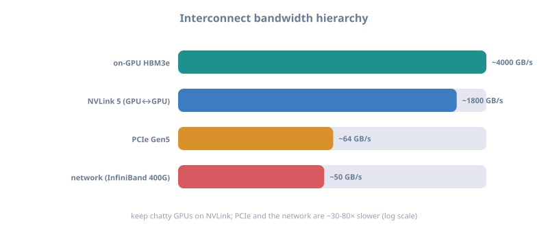
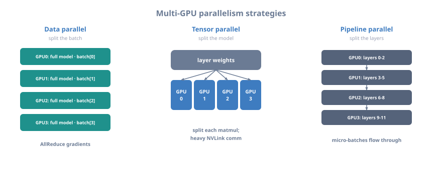

# 17 — Multi-GPU Programming

> Part of **[CUDA Know-Hows](README.md)**. Prev: [16 — CUDA graphs](16_cuda_graphs.md).
> Next: [18 — Profiling & debugging](18_profiling_and_debugging.md).
> Runnable code: [`examples/19_multi_gpu.cu`](examples/19_multi_gpu.cu).
>
> Goal: scale beyond one GPU. You'll learn device management, peer-to-peer (P2P)
> access over NVLink/PCIe, the interconnect hierarchy, NCCL collectives (the
> backbone of distributed deep learning), and the parallelism strategies (data /
> model / pipeline / tensor).

---

## 1. Why and when to go multi-GPU

```
   GO MULTI-GPU WHEN:
     - the problem/model doesn't fit in one GPU's memory (e.g. a 70B-param LLM)
     - one GPU is too slow and the work parallelizes across devices
     - you have the hardware (a node with 4-8 GPUs, or many nodes)

   THE CENTRAL CHALLENGE: communication. GPUs must exchange data, and the
   interconnect between them is slower than on-GPU memory. Scaling well = keeping
   GPUs busy while minimizing and overlapping cross-GPU communication.
```

---

## 2. Managing multiple devices

```cpp
int n; cudaGetDeviceCount(&n);
for (int d = 0; d < n; ++d) {
    cudaSetDevice(d);                         // subsequent calls target device d
    cudaDeviceProp p; cudaGetDeviceProperties(&p, d);
    printf("GPU %d: %s\n", d, p.name);
    cudaMalloc(&buf[d], bytes);               // allocates on device d
    kernel<<<g, b, 0, stream[d]>>>(buf[d]);   // launches on device d
}
```

```
   KEY RULE: cudaSetDevice(d) sets the "current" device for the calling host
   thread. Allocations, launches, and stream creation all target the current
   device. Each GPU should have its OWN stream(s); drive them from one thread
   (looping setDevice) or one host thread per GPU.
```

---

## 3. The interconnect hierarchy (bandwidth matters)

Where GPUs sit relative to each other decides how fast they can talk.



<details class="ascii-diagram">
<summary>ASCII diagram</summary>
<pre><code>   ┌────────────────────────────────────────────────────────────────────────────┐
   │ path                     approx bandwidth   notes                          │
   ├────────────────────────────────────────────────────────────────────────────┤
   │ on-GPU global memory     TB/s (2-8+)        HBM3e — the baseline           │
   │ NVLink (GPU&lt;-&gt;GPU)       100s GB/s - 1.8TB/s NVLink 5 (Blackwell)          │
   │ NVSwitch (all-to-all)    full NVLink BW      GB200 NVL72: 72 GPUs meshed   │
   │ PCIe (GPU&lt;-&gt;GPU/CPU)     ~32-64 GB/s (Gen5)  much slower than NVLink       │
   │ network (node&lt;-&gt;node)    InfiniBand 400Gb/s  multi-node; use GPUDirect RDMA│
   └────────────────────────────────────────────────────────────────────────────┘

   Query the topology:  nvidia-smi topo -m   (shows NVLink vs PCIe between GPUs)</code></pre>
</details>

```
   Communication is ~10-100x slower than local memory. Every design decision is
   about doing less of it, and overlapping what remains with compute (Ch. 13).
```

---

## 4. Peer-to-peer (P2P) access

If two GPUs are connected (NVLink or PCIe with P2P support), one can read/write
the other's memory directly, and copies go GPU→GPU without staging through the
CPU.

```cpp
int canAccess;
cudaDeviceCanAccessPeer(&canAccess, 0, 1);       // can GPU0 access GPU1?
if (canAccess) {
    cudaSetDevice(0); cudaDeviceEnablePeerAccess(1, 0);   // 0 can access 1
    cudaSetDevice(1); cudaDeviceEnablePeerAccess(0, 0);   // 1 can access 0
}
// Direct GPU->GPU copy (uses NVLink if available):
cudaMemcpyPeerAsync(dst1, /*dstDev*/1, src0, /*srcDev*/0, bytes, stream);
```

```
   WITHOUT P2P:  GPU0 --copy--> CPU RAM --copy--> GPU1   (two PCIe hops, slow)
   WITH P2P:     GPU0 ============NVLink===========> GPU1 (one direct hop, fast)
   A kernel on GPU0 can even dereference a pointer into GPU1's memory when P2P is
   enabled — handy, but remote accesses are slower than local; use deliberately.
```

---

## 5. NCCL — the collective communication backbone

For real multi-GPU (and multi-node) work, use **NCCL** (NVIDIA Collective
Communications Library). It implements topology-aware, high-bandwidth collectives
(the same primitives as MPI, Ch. `cpp-hpc` M12) optimized for GPUs and NVLink.

```
   NCCL COLLECTIVES (each GPU = a "rank"):
     AllReduce   : sum (or max/min) a tensor across all GPUs; result on ALL
                   -> THE operation in data-parallel training (gradient averaging)
     Broadcast   : one GPU's data -> all GPUs
     Reduce      : combine across GPUs -> result on one GPU
     AllGather   : each GPU contributes a shard -> all GPUs get the full tensor
     ReduceScatter: reduce then scatter shards (half of AllReduce)
     All2All     : each GPU sends a distinct chunk to every other (MoE routing)
```

```cpp
ncclComm_t comms[nGPUs];
ncclCommInitAll(comms, nGPUs, devs);             // set up communicators
// each GPU sums its gradient buffer into a global average:
ncclGroupStart();
for (int g = 0; g < nGPUs; ++g)
    ncclAllReduce(sendbuf[g], recvbuf[g], count, ncclFloat, ncclSum,
                  comms[g], stream[g]);
ncclGroupEnd();
```

```
   RING ALLREDUCE (how NCCL gets near-peak bandwidth on N GPUs):
     GPU0 ─▶ GPU1 ─▶ GPU2 ─▶ GPU3 ─▶ (ring back to GPU0)
   Data flows around the ring in chunks; each GPU sends and receives simultaneously.
   Bandwidth-optimal and scales with the number of GPUs. NCCL picks ring/tree/
   NVLS automatically based on topology and message size.
```

---

## 6. Parallelism strategies (especially for deep learning)



<details class="ascii-diagram">
<summary>ASCII diagram</summary>
<pre><code>   DATA PARALLEL: replicate the model on each GPU, split the BATCH across GPUs,
     AllReduce gradients each step. Simplest; scales until comm dominates.
       GPU0: model | batch[0:N/4]  ┐
       GPU1: model | batch[N/4:N/2]├─ forward/backward independently
       GPU2: ...                   │  then ncclAllReduce(gradients)
       GPU3: ...                   ┘

   MODEL / TENSOR PARALLEL: split the MODEL (each layer&#x27;s weights/matmul) across
     GPUs; needed when the model doesn&#x27;t fit on one GPU. Heavy communication
     (AllGather/ReduceScatter within each layer) -&gt; keep GPUs NVLink-connected.

   PIPELINE PARALLEL: put different LAYERS on different GPUs; micro-batches flow
     through the pipeline. Reduces per-GPU memory; needs careful scheduling to
     avoid &quot;bubbles&quot; (idle GPUs while the pipeline fills/drains).

   In practice large models combine all three (&quot;3D parallelism&quot;), with NCCL doing
   the communication. Frameworks (Megatron, DeepSpeed, FSDP) implement these.</code></pre>
</details>

---

## 7. Overlapping communication with computation

The multi-GPU version of Chapter 13's lesson: don't stall GPUs waiting on the
network. Overlap gradient AllReduce with the backward pass, prefetch the next
layer's weights while computing the current one, etc.

```
   NAIVE:     [compute all] then [communicate all]   -> GPUs idle during comm
   OVERLAP:   [compute layer L][compute L-1]...       compute proceeds while
              [   AllReduce grads of L in parallel]   earlier layers' grads reduce
   Use separate streams for compute and NCCL, ordered with events (Ch. 13).
```

Run the multi-GPU example (falls back gracefully with one GPU):

```bash
cd examples && make 19_multi_gpu && ./19_multi_gpu
```

---

## 8. Key takeaways

- Go multi-GPU when the model/data won't fit or one GPU is too slow; the central
  challenge is **communication**, which is 10–100× slower than local memory.
- Use `cudaSetDevice` to target devices; give **each GPU its own streams**.
- Know the **interconnect hierarchy** (NVLink/NVSwitch ≫ PCIe ≫ network);
  check `nvidia-smi topo -m`.
- Enable **P2P** for direct GPU↔GPU copies/access over NVLink.
- Use **NCCL** for collectives (**AllReduce** is the heart of data-parallel
  training); it's topology-aware and bandwidth-optimal (ring/tree/NVLS).
- Choose a **parallelism strategy** (data / tensor / pipeline, often combined) and
  **overlap communication with computation** to scale efficiently.

**Next:** [18 — Profiling & debugging →](18_profiling_and_debugging.md)
